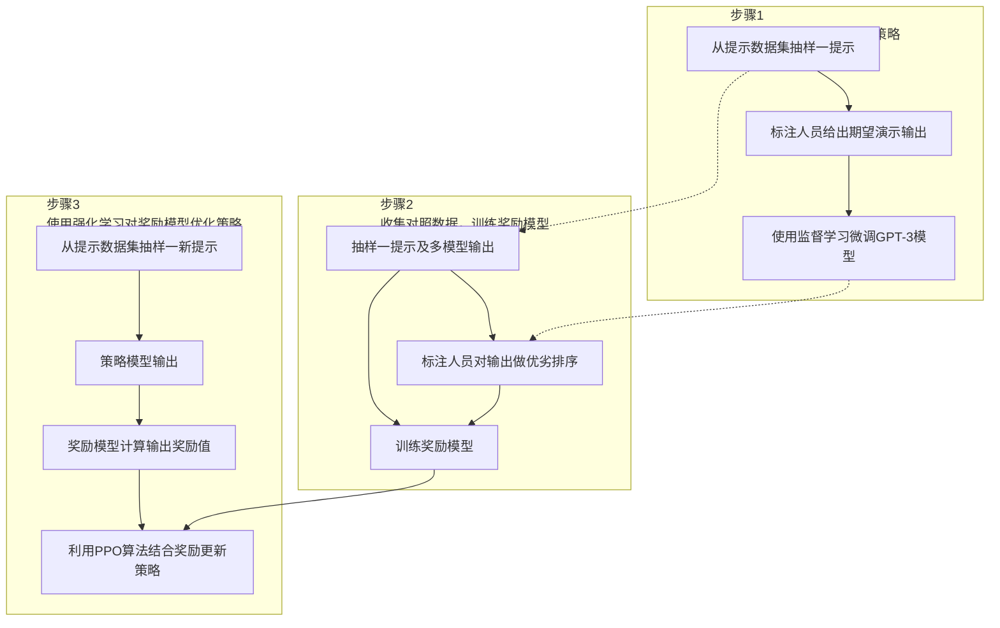
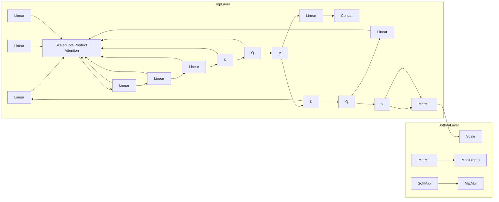

# 中国人工智能系列白皮书

# ——大模型技术（2023版）

中国人工智能学会

二〇二三年九月

# 《中国人工智能系列白皮书》编委会

主 任：戴琼海

执行主任：王国胤

副主任：陈杰 何友 刘成林 刘宏 孙富春 王恩东
王文博 赵春江 周志华

委员：班晓娟 曹鹏 陈纯 陈松灿 邓伟文 董振江

杜军平 付宜利 古天龙 桂卫华 何清 胡国平

黄河燕 季向阳 贾英民 焦李成 李斌 刘民

刘庆峰 刘增良 鲁华祥 马华东 苗夺谦 潘纲

朴松昊 钱 锋 乔俊飞 孙长银 孙茂松 陶建华

王卫宁 王熙照 王轩 王蕴红 吾守尔·斯拉木

吴晓蓓 杨放春 于 剑 岳 东 张小川 张学工

张毅章毅 周国栋 周鸿祎 周建设 周杰

祝烈煌 庄越挺

## 《中国人工智能系列白皮书----大模型技术》编写组

陶建华 吴飞 黄民烈 文继荣 王海峰 刘知远

刘 静 杨小康 聂 帅

## 目录

## 第 1 章 大模型技术概述 …… 1

1.1 大模型技术的发展历程 ..... 1  
1.2 大模型技术的生态发展....5  
1.3 大模型技术的风险与挑战 ..... 7

## 第 2 章 语言大模型技术 ……9

2.1 Transformer 架构....9  
2.2 语言大模型架构 ..... 13

2.2.1 掩码语言建模....13  
2.2.2 自回归语言建模 ..... 14  
2.2.3 序列到序列建模 ..... 14

## 2.3 语言大模型关键技术 ..... 15

2.3.1 语言大模型的预训练 ..... 15  
2.3.2 语言大模型的适配微调 ..... 17  
2.3.3 语言大模型的提示学习 ..... 20  
2.3.4 语言大模型的知识增强 ..... 22  
2.3.5 语言大模型的工具学习 ..... 23

## 第 3 章 多模态大模型技术 ……25

3.1.1 面向理解任务的多模态大模型 ..... 25  
3.1.2 面向生成任务的多模态大模型 ..... 27  
3.1.3 兼顾理解和生成任务的多模态大模型 ..... 29  
3.1.4 知识增强的多模态大模型 ..... 31

## 3.1 多模态大模型的技术体系 ..... 25

## 3.2 多模态大模型的关键技术....32

3.2.1 多模态大模型的网络结构设计 ..... 32

3.2.2 多模态大模型的自监督学习优化....33  
3.2.3 多模态大模型的下游任务微调适配....35

## 第 4 章 大模型技术生态 ……37

4.1 典型大模型平台 ..... 37  
4.2 典型开源大模型 ..... 40

4.2.1 典型开源语言大模型 ..... 40  
4.2.2 典型开源多模态大模型 ..... 49

4.3 典型开源框架与工具 ..... 53  
4.4 大模型的训练数据 ..... 56

4.4.1 大模型的训练数据处理流程和特点 ..... 56  
4.4.2 大模型常用的公开数据集 ..... 59

## 第 5 章 大模型的开发训练与推理部署 ……62

5.1 大模型开发与训练 ..... 62  
5.2 大模型推理部署 ..... 64

5.2.1 大模型压缩 ..... 65  
5.2.2 大模型推理与服务部署 ..... 66

5.3 软硬件适配与协同优化....67

5.3.1 大模型的软硬件适配....68  
5.3.2 大模型的软硬件协同优化 ..... 68

## 第 6 章 大模型应用 ..... 70

6.1 信息检索 ..... 70  
6.2 新闻媒体 ..... 71  
6.3 智慧城市 ..... 72  
6.4 生物科技 ....72  
6.5 智慧办公 ..... 73  
6.6 影视制作 ..... 74  
6.7 智能教育 ..... 74

6.8 智慧金融 ..... 75  
6.9 智慧医疗....75  
6.10 智慧工厂 75  
6.11 生活服务....76  
6.12 智能机器人....76  
6.13 其他应用 ..... 76

## 第 7 章 大模型的安全性 ..... 78

7.1 大模型安全风险引发全球广泛关注....78  
7.2 大模型安全治理的政策法规和标准规范 ..... 79  
7.3 大模型安全风险的具体表现 .....81

7.3.1 大模型自身的安全风险....81  
7.3.2 大模型在应用中衍生的安全风险 ..... 82

7.4 大模型安全研究关键技术 ..... 84

7.4.1 大模型的安全对齐技术 ..... 84  
7.4.2 大模型安全性评测技术 ..... 87

## 第 8 章 总结与思考 ..... 90

8.1 协同多方合作，共同推动大模型发展....91  
8.2 建立大模型合规标准和评测平台 ..... 92  
8.3 应对大模型带来的安全性挑战 ..... 93  
8.4 开展大模型广泛适配，推动大模型技术栈自主可控....94

## 名词索引....95

## 参考文献....97

## 编写人员贡献....116

## 第 1 章 大模型技术概述

## 1.1 大模型技术的发展历程

2006年Geoffrey Hinton提出通过逐层无监督预训练的方式来缓解由于梯度消失而导致的深层网络难以训练的问题[1]，为神经网络的有效学习提供了重要的优化途径。此后，深度学习在计算机视觉[2]、语音[3]、自然语言处理[4]等众多领域取得了突破性的研究进展，开启了新一轮深度学习的发展浪潮。总结过去十多年的技术发展，基于深度学习的人工智能技术主要经历了如下的研究范式转变：从早期的“标注数据监督学习”的任务特定模型，到“无标注数据预训练+标注数据微调”的预训练模型，再到如今的“大规模无标注数据预训练+指令微调+人类对齐”的大模型，经历了从小数据到大数据，从小模型到大模型，从专用到通用的发展历程，人工智能技术正逐步进入大模型时代。

2022 年底，由 OpenAI 发布的语言大模型 ChatGPT 引发了社会的广泛关注。在“大模型+大数据+大算力”的加持下，ChatGPT 能够通过自然语言交互完成多种任务，具备了多场景、多用途、跨学科的任务处理能力。以 ChatGPT 为代表的大模型技术可以在经济、法律、社会等众多领域发挥重要作用。大模型被认为很可能像 PC 时代的操作系统一样，成为未来人工智能领域的关键基础设施，引发了大模型的发展热潮。

本次大模型热潮主要由语言大模型（亦称为大语言模型）引领。语言大模型通过在海量无标注数据上进行大规模预训练，能够学习到大量的语言知识与世界知识，并且通过指令微调、人类对齐等关键技术拥有面向多任务的通用求解能力。在原理上，语言大模型旨在构建面向文本序列的概率生成模型，其发展过程主要经历了四个主要阶段[5]：

1）统计语言模型：统计语言模型主要基于马尔可夫假设建模文本序列的生成概率。特别地，N-gram 语言模型[6]认为下一个词汇的生成概率只依赖于前面出现的 N 个词汇（即 N 阶马尔可夫假设）。此类语言模型的问题在于容易受到数据稀疏问题的影响，需要使用平滑策略改进概率分布的估计，对于文本序列的建模能力较弱。  
2）神经语言模型：针对统计语言模型存在的问题，神经语言模型主要通过神经网络（MLP[7]、RNN[8]）建模目标词汇与上下文词汇的语义共现关系，能够有效捕获复杂的语义依赖关系，更为精准建模词汇的生成概率。进一步，word2vec[4]简化了神经语言模型的网络架构，可以从无监督语料中学习可迁移的词表示（又称为词向量或词嵌入），为后续预训练语言模型的研究奠定了基础。  
3) 预训练语言模型：预训练语言模型主要是基于“预训练+微调”的学习范式构建，首先通过自监督学习任务从无标注文本中学习可迁移的模型参数，进而通过有监督微调适配下游任务。早期的代表性预训练语言模型包括ELMo[9]、GPT-1[10]和BERT[11]等。其中，ELMo模型基于传统的循环神经网络（LSTM）[12]构建，存在长距离序列建模能力弱的问题；随着Transformer[13]的提出，神经网络序列建模能力得到了显著的提升，GPT-1和BERT都是基于Transformer架构构建的，可通过微调学习解决大部分的自然语言处理任务。  
4）语言大模型（探索阶段）：在预训练语言模型的研发过程中，一个重要的经验性法则是扩展定律（Scaling Law）[14]：随着模型参数规模和预训练数据规模的不断增加，模型能力与任务效果将会随之改善。图1-1展示了2018至2023年间典型预训练模型的参数量变化趋势。OpenAI在研发GPT系列模型过程中，主要探索了GPT-1[10]（1.1亿参数）、GPT-2（15亿参数）[15]、以及GPT-3（1750亿参数）[16]三个不同参数规模的模型，谷歌也推出了参数规模高达5400亿参数的PaLM模型[17]。当模型参数规模达到千亿量级，语言大模型

能够展现出多方面的能力跃升[18]。例如，GPT-3在没有微调的情况下，可以仅通过提示词或少数样例（In-context learning，上下文学习[19]）完成多种任务，甚至在某些任务上超过当时最好的专用模型。学术界引入了“语言大模型”（Large language models）[5]来特指这种超大规模的预训练语言模型，以突出与早期预训练语言模型的不同。

图 1-1 2018-2023 年模型参数规模变化图  
.pdf_result/images/chunk0000_c5589145c83c70cc3b7f23dddedaf9bb27758ebc8d765f9eb3a302a9b0fa5e03.jpg)

<details>
<summary>line</summary>

| Model | Parameters (B) |
| --- | --- |
| ELMo | 94 |
| BERT-Large | 340 |
| Megatron-LM | 8.3 |
| GPT-2 | 1.5 |
| T5 | 11 |
| Turing-NLG | 11 |
| \(GPT-3\) | 175 |
| \(PanGu-\alpha\) | 200 |
| CPM-2-MoE | 198 |
| Switch-Transformer | 1571 |
| M6-10T | ~12000 |
| Megatron-Turing NLG | 530 |
| PaLM | 540 |
| GaLM | 1.2 |
</details>

5）语言大模型（提升阶段）：虽然早期的语言大模型表现出一定的少样本学习能力，但是其学习目标主要通过预测下一个单词实现，仍不能很好地遵循人类指令，甚至会输出无用的、有害的信息，难以有效对齐人类的偏好。针对这些问题，主要有两种大模型改进技术，包括指令微调（Instruction Tuning）[20]以及基于人类反馈的强化学习(Reinforcement Learning from Human Feedback, RLHF)[21]。指令微调利用格式化（指令和回答配对）的训练数据加强大模型的通用任务泛化能力；基于人类反馈的强化学习（如图1-2所示）将人类标注者引入到大模型的学习过程中，训练与人类偏好对齐的奖励模型，进而有效指导语言大模型的训练，使得模型能够更好地遵循用户意图，生成符合用户偏好的内容。在大模型使用过程中，可以使用各种提示技术（包括思维链（Chain-of-Thoughts, CoT）[22]、思维树（Tree-of-Thoughts, ToT）[23]等），从而更好地利用大模型的潜在能力，提升大模型解决实际问题的能力。进一步，语言大模型主要是基于文本数据形式进行训练与推理，存在一些特定能力的不足，例如数值计算等。针对这一问题，可以使用外部工具（如计算器、搜索引擎等）扩展大模型的能力边界[24]。

.pdf_result/images/chunk0000_6ec044ec52bfa4de9b932c640c2af3bd65f8ff4058d6b4fe8dc525e9dcc3f91d.jpg)

<details>
<summary>flowchart</summary>


</details>

图 1-2 基于人类反馈强化学习的算法示意图

作为重要前沿探索力量，OpenAI 对于语言大模型的研发工作主要是在 Transformer 架构推出后开展，形成了一系列的技术进展。其中，GPT-1 探索了解码器 Transformer 架构（decoder-only Transformer）在“预训练+微调”范式下的自然语言任务求解能力；GPT-2 初步验证了扩大模型参数规模的有效性（扩展法则），并且探索了基于自然语言提示的多任务解决能力；GPT-3 首次探索了千亿参数规模的语言模型效果，提出了基于“上下文学习”的任务解决方法；CodeX[25] 使用代码数据对 GPT-3 进行微调，从而提升代码能力和复杂推理能力；InstructGPT[21] 基于人类反馈的强化学习技术（RLHF），能够强化对于人类指令的遵循能力和人类偏好的对齐能力；ChatGPT 与 InstructGPT 的技术原理相似，进一步引入了对话数据进行学习，从而加强了多轮对话能力；GPT-4[26] 能够处理更长的上下文窗口，具备多模态理解能力，在逻辑推理、复杂任务处理方面的能力得到显著改进，但其他相关技术细节未予披露。

随着 GPT-4 的成功，语言大模型对于多模态领域也产生了重要影响，它从单调的文本交互，升级为可以接受文本与图像组合的多模态输入，相比传统的单模态大模型，多模态大模型更加符合人类的多渠道感认知方式，能够应对更加复杂丰富的环境、场景和任务。GPT-4 表明在多模态大模型中引入基于人类知识的自然语言能够带来模型在多模态理解、生成、交互能力上的。

## 1.2 大模型技术的生态发展

大模型服务平台正向个人开放及商业落地应用延伸,不同公司互有侧重,为用户提供了多种获取大模型能力的途径。OpenAI API 较早地面向公众开放的大模型服务平台,用户可以通过 API 访问不同的 GPT 模型来完成下游任务。Claude 系列模型是由 Anthropic 开发的闭源语言大模型,目前包含 Claude 和 Claude-Instant 两种模型可供选择。该系列模型通过无监督预训练、基于人类反馈的强化学习和 Constitutional AI 技术（包含监督训练和强化学习）进行训练，旨在改进模型的有用性、诚实性和无害性。Claude 最高支持 100K 词元的上下文，而 Claude-2 更是拓展到了 200K 词元的上下文。文心一言是基于百度文心大模型的知识增强语言大模型，提供 APP、网页版、API 接口等多种形式的开放服务。文心一言还建设了插件机制，通过外部工具、服务的调用，拓展大模型的能力的边界。讯飞星火认知大模型具有开放式知识问答、多轮对话、逻辑和数学能力，并且具有较强的对代码和多模态的理解能力。讯飞和华为还联合重磅发布了国内首款支持大模型训练私有化的全国产化产品“星火一体机”，可支持企业快速实现讯飞星火大模型的私有化部署、场景赋能和专属大模型训练优化。

大模型的开源生态也 “百花齐放”，主要包括开源框架与开源大模型。开源框架可以有效地支撑大规模模型的训练，如：PyTorch[27]提供了分桶梯度、通信计算重叠、跳过同步等技术,支持大规模的分布式数据并行训练;飞桨[28]是国产的深度学习框架,早在内部就支持了大规模分布式训练,覆盖了计算机视觉、自然语言处理等多个领域的模型,其中4D混合并行策略,可训练千亿规模模型;OneFlow将分布式集群抽象成逻辑上的超级设备,支持动静态图灵活转换,以数据+模型混合并行提升性能;DeepSpeed[29]是微软推出的大模型训练框架,其中ZeRO技术减少冗余内存访问,使得可以训练万亿级模型。开源大模型可降低大模型研究的门槛,促进大模型应用的繁荣。其中典型代表有:LLaMA[30]系列是Meta研发的开源大模型,参数规模从7B到65B不等,仅依赖公开数据集进行预训练,通过数据过滤和并行优化实现高效训练。Falcon[31]系列来自阿布扎比的TII研究院,最大规模达180B参数,基于开源许可发布,性能与GPT-4和PaLM2相当,参数量却较小。GLM[32]系列采用空白填充等多任务联合训练方式,提升了模型的生成能力。Baichuan系列模型由百川智能开发,支持中英双语,使用高质量训练数据,在多个基准测试上表现优秀,该系列模型还开源了多种量化版本。Baichuan 2在保留原有模型优势的基础上,增强了逻辑推理等方面的能力。CPM [33][34]系列采用经典的语言模型自回归训练方式,在各类中文NLP任务上均表现卓越。

大模型技术具有广泛的应用场景，可以用来赋能不同行业。大模型+传媒可以实现智能新闻写作，降低新闻的生产成本；大模型+影视可以拓宽创作素材，开拓创作思路，激发创作灵感，提升作品质量；大模型+营销可以打造虚拟客服，助力产品营销；大模型+娱乐可以加强人机互动，激发用户参与热情，增加互动的趣味性和娱乐性；大模型+军事可以增强军事情报和决策能力，可以实现实时战场翻译，快速准确的威胁评估、作战任务规划和执行、战场感知、战术决策支持、改进态势感知等；大模型+教育可以赋予教育教材新活力，让教育方式更个性化、更智能；大模型+金融可以帮助金融机构降本增效，让金融服务更有温度；大模型+医疗可以赋能医疗机构诊疗全过程。总之，大模型的发展将给人类带来了非常强大的助推力，让数字世界和现实世界的共生变得更为便捷、更为有效。

大模型的通用性使其被认为是可以成为未来人工智能应用中的关键基础设施，就像 PC 时代的操作系统一样，赋能百业，加速推进国民经济的高质量发展。向上，大模型可带动上游软硬件计算平台的革新，形成高性能软硬件与大模型的协同发展，构建“大模型+软硬件+数据资源”上游发展生态；向下，大模型可以打造“大模型+应用场景”的下游应用生态，加速全产业的智能升级，对经济、社会和安全等领域的智能化升级中形成关键支撑。

## 1.3 大模型技术的风险与挑战

尽管以 ChatGPT 为代表的大模型技术取得关键性突破，但当前大模型技术仍存在诸多风险与挑战。

首先，大模型的可靠性无法得到有效保障。例如，基于海量数据训练的语言大模型，尽管其生成的内容符合语言规则、通顺流畅且与人类偏好对齐，但其合成内容在事实性、时效性方面等仍存在较多问题，尚无法对所合成内容做出可靠评估[35][36]。

其次，大模型的可解释性存在不足。大模型基于深度神经网络，为黑盒模型，其工作机理仍难以理解。语言大模型的涌现能力[18]、规模定律[14]，多模态大模型的知识表示、逻辑推理能力、泛化能力、情景学习能力[19][37]等方面有待展开深入研究，为大模型的大规模实际应用提供理论保障。

再次，大模型应用部署代价高。大模型参数规模和数据规模都非常巨大，存在训练和推理计算量大、功耗高、应用成本高、端侧推理存在延迟等问题，从而限制了其落地应用。提高推理速度降低大模型使用成本是大规模应用的关键。

此外，大模型在小数据情景下的迁移能力存在不足。大模型基于数据驱动深度学习方式，依赖训练数据所覆盖的场景，由于复杂场景数据不足，大模型存在特定场景适用性不足的问题，面临鲁棒性和泛化性等挑战。提升大模型对小数据的高效适配迁移能力是未来研究的重点。

最后，大模型还存在伴生技术风险问题。例如，语言大模型具有通用的自然语言理解和生成能力，其与语音合成、图像视频生成等技术结合可以产生人类难以辨别的音视频等逼真多媒体内容，可能会被滥用于制造虚假信息、恶意引导行为，诱发舆论攻击、甚至危害国家安全[38][39]。此外，大模型存在安全与隐私问题，目前针对大模型安全漏洞的典型攻击方式包括：数据投毒攻击、对抗样本攻击、模型窃取攻击、后门攻击、指令攻击。大模型的安全漏洞可能被攻击者利用，使得大模型关联业务面临整体失效的风险，威胁以其为基础构建的应用生态。大模型利用海量的互联网数据进行训练，包括个人、企业甚至国家的敏感数据可能被编码进大模型参数中，因而存在数据隐私问题。例如，通过提示信息可能诱发大模型隐私数据泄露问题。

## 第 2 章 语言大模型技术

近年来，在 Transformer 架构基础上构建的预训练语言模型为自然语言处理领域带来了一系列突破式进展，成为人工智能主流技术范式。预训练语言模型采用“预训练+微调”方法，主要分为两步：1）将模型在大规模无标注数据上进行自监督训练得到预训练模型，2）将模型在下游各种自然语言处理任务上的小规模有标注数据进行微调得到适配模型。由于预训练语言模型参数越大模型表现越好，这激发了语言大模型（Large Language Model, LLM）研究热潮。

## 2.1 Transformer 架构

Transformer 架构[13]是目前语言大模型采用的主流架构[5], 其基于自注意力机制(Self-attention Mechanism)模型。其主要思想是通过自注意力机制获取输入序列的全局信息, 并将这些信息通过网络层进行传递。标准的 Transformer 如图 2-1 所示, 是一个编码器-解码器架构, 其编码器和解码器均由一个编码层和若干相同的 Transformer 模块层堆叠组成, 编码器的 Transformer 模块层包括多头注意力层和全连接前馈网络层, 这两部分通过残差连接和层归一化操作连接起来。与编码器模块相比, 解码器由于需要考虑解码器输出作为背景信息进行生成, 其中每个 Transformer 层多了一个交叉注意力层。相比于传统循环神经网络（Recurrent Neural Network, RNN）和长短时记忆神经网络（Long Short-Term Memory Network, LSTM), Transformer 架构的优势在于它的并行计算能力, 即不需要按照时间步顺序地进行计算。

Transformer 架构包含编码层与 Transformer 模块两个核心组件，

编码层，主要是将输入词序列映射到连续值向量空间进行编码，每个词编码由词嵌入和位置编码构成，由二者加和得到：

1）词嵌入，在 Transformer 架构中，词嵌入是输入数据的第一步处理过程，它将词映射到高维空间中的向量，可以捕获词汇的语义信息，如词义和语法关系。每个词都被转化为一个固定长度的向量，然

后被送入模型进行处理。

.pdf_result/images/chunk0000_0ec9fc1f68db04d1d54d287c528d45abb9aa3dc367d74acbe4e695eee4b46cb1.jpg)

<details>
<summary>flowchart</summary>

```mermaid
graph TD
  subgraph Encoder["编码器"]
    direction TB
  Input["输入"] --> Embed["词嵌入"]
  Embed --> AddN["位置编码"]
  AddN --> AddN1((+))
  AddN1 --> MultiHeadAttention["多头自注意力"]
  MultiHeadAttention --> MultiLayer1["残差连接和层归一化"]
  MultiLayer1 --> AddN2((+))
  AddN2 --> MultiLayer2["全连接前馈层"]
  MultiLayer2 --> AddN3((+))
  AddN3 --> MultiLayer3["残差连接和层归一化"]
  MultiLayer3 --> AddN4((+))
  AddN4 --> MultiLayer4["多头自注意力"]
  MultiLayer4 --> MultiLayer5["残差连接和层归一化"]
  MultiLayer5 --> AddN5((+))
  AddN5 --> MultiLayer6["全连接前馈层"]
  MultiLayer6 --> AddN6((+))
  AddN6 --> MultiLayer7["残差连接和层归一化"]
  MultiLayer7 --> AddN7((+))
  AddN7 --> MultiLayer8((+))
  MultiLayer8 --> AddN8((+))
  AddN8 --> MultiLayer9((+))
  MultiLayer9 --> AddN9((+))
  AddN9 --> MultiLayer10((+))
  MultiLayer10 --> AddN10((+))
  AddN10 --> MultiLayer11((+))
  MultiLayer11 --> AddN11((+))
  AddN11 --> MultiLayer12((+))
  MultiLayer12 --> AddN12((+))
  AddN12 --> MultiLayer13((+))
  MultiLayer13 --> AddN13((+))
  AddN13 --> MultiLayer14((+))
  MultiLayer14 --> AddN14((+))
  AddN14 --> MultiLayer15((+))
  MultiLayer15 --> AddN15((+))
  AddN15 --> MultiLayer16((+))
  MultiLayer16 --> AddN16((+))
  AddN16 --> MultiLayer17((+))
  MultiLayer17 --> AddN17((+))
  AddN17 --> MultiLayer18((+))
  MultiLayer18 --> AddN18((+))
  AddN18 --> MultiLayer19((+))
  MultiLayer19 --> AddN19((+))
  AddN19 --> MultiLayer20((+))
  MultiLayer20 --> AddN20((+))
  AddN20 --> MultiLayer21((+))
  MultiLayer21 --> AddN21((+))
  AddN21 --> MultiLayer22((+))
  MultiLayer22 --> AddN22((+))
  AddN22 --> MultiLayer23((+))
  MultiLayer23 --> AddN23((+))
  AddN23 --> MultiLayer24((+))
  MultiLayer24 --> AddN24((+))
  AddN24 --> MultiLayer25((+))
  MultiLayer25 --> AddN25((+))
  AddN25 --> MultiLayer26((+))
  MultiLayer26 --> AddN26((+))
  AddN26 --> MultiLayer27((+))
  MultiLayer27 --> AddN27((+))
  AddN27 --> MultiLayer28((+))
  MultiLayer28 --> AddN28((+))
  AddN28 --> MultiLayer29((+))
  MultiLayer29 --> AddN29((+))
  AddN29 --> MultiLayer30((+))
  MultiLayer30 --> AddN30((+))
  AddN30 --> MultiLayer31((+))
  MultiLayer31 --> AddN31((+))
  AddN31 --> MultiLayer32((+))
  MultiLayer32 --> AddN32((+))
  AddN32 --> MultiLayer33((+))
  MultiLayer33 --> AddN33((+))
  AddN33 --> MultiLayer34((+))
  MultiLayer34 --> AddN34((+))
  AddN34 --> MultiLayer35((+))
  MultiLayer35 --> AddN35((+))
  AddN35 --> MultiLayer36((+))
  MultiLayer36 --> AddN36((+))
  AddN36 --> MultiLayer37((+))
  MultiLayer37 --> AddN37((+))
  AddN37 --> MultiLayer38((+))
  MultiLayer38 --> AddN38((+))
  AddN38 --> MultiLayer39((+))
  MultiLayer39 --> AddN39((+))
  AddN39 --> MultiLayer40((+))
  MultiLayer40 --> AddN40((+))
  AddN40 --> MultiLayer41((+))
  MultiLayer41 --> AddN41((+))
  AddN41 --> MultiLayer42((+))
  MultiLayer42 --> AddN42((+))
  AddN42 --> MultiLayer43((+))
  MultiLayer43 --> AddN43((+))
  AddN43 --> MultiLayer44((+"))
  end

  subgraph Decoder["解码器"]
    direction TB
    DecoderA["全连接层"] -.-> DecoderA
  end

  subgraph Transformer["Transformer模块 × N"]
    direction TB
    TransformerA["位移编码"] -.-> TransformerA
  end

  subgraph Encoder["编码器"]
    EncoderA["位置编码"] -.-> EncoderA
  end
```
</details>

图 2-1 Transformer 架构[13]

2）位置编码，由于自注意力机制本身对位置信息不敏感，为了让模型能够理解序列中的顺序信息，引入了位置编码。标准Transformer架构的位置编码方式是使用正弦和余弦函数的方法。对于每个位置 $i$ ，对应的位置编码是一个长度为 $d$ 的向量，其中 $d$ 是模型的嵌入维度。这个向量的第 $j$ 个元素由以下公式计算：如果 $j$ 是偶数，那么编码的第 $j$ 个元素为 $\sin (i / 10000^{j / d})$ ；如果 $j$ 是奇数，那么编码的第 $j$ 个元素为 $\cos (i / 10000^{j / d})$ 。

.pdf_result/images/chunk0000_a39e29566101f85f4c7d291a379803c78fd5fade8f8e515a2511f5e6072c1560.jpg)

<details>
<summary>flowchart</summary>


</details>

图 2-2 Transformer 自注意力网络[13]

Transformer 模块, 通过自注意力机制获取输入序列的全局信息, 并将这些信息通过网络层进行传递, 包括多头注意力层和全连接前馈网络层, 这两部分通过残差连接和层归一化操作连接起来, Transformer 模块, 由自注意力层、全连接前馈层、残差连接和层归一化操作等基本单元组成:

1）自注意力层，注意力（Attention）是Transformer模型的核心组成部分。它包含一个查询矩阵 $Q\in\square^{n\times d_{k}}$ ，一个键矩阵 $K\in\square^{m\times d_{k}}$ 和一个值矩阵 $V\in\square^{m\times d_{v}}$ ，其中矩阵中的每一行对应一个词。注意力机制的计算方式：

$$
H = \text {Attention} (Q, K, V) = \text {Softmax} (\frac {Q K ^ {T}}{\sqrt {d _ {k}}}) V
$$

直观来说，矩阵 $H \in \square^{n \times d_v}$ 中的每一行是 $V$ 中行向量的加权和，其中权重由查询向量和键矩阵的点积决定。记具有序列长度 $n$ 的查询序列的特征矩阵和具有序列长度为 $m$ 的键-值序列的特征矩阵分别为 $X_q \in \square^{n \times d}$ 和 $X_{kv} \in \square^{m \times d}$ ，三个矩阵 $Q$ 、 $K$ 、 $V$ 由三个线性变换得到 $Q = X_q W_q, K = X_{kv} W_k, V = X_{kv} W_v$ . Transformer 模型采用的特定注意力机制被称为自注意力机制，因为三个矩阵 $Q$ 、 $K$ 、 $V$ 都来自于前一层的相

同特征矩阵 $X \in \square^{n \times d}$ 。

此外，Transformer 采用了多头自注意力（Multi-head Attention）机制，即输入序列被线性映射多次得到不同的投影矩阵。多个尺度化后点积注意力可以并行计算，并产生多个自注意力输出。多头注意力生成多个高维的注意力表示，这使得其比单头注意力具有更强的表达能力。多头注意力的计算方式如下：使用了多个查询矩阵 $Q^{(i)}$ ，键矩阵 $K^{(i)}$ 和值矩阵 $V^{(i)}$ ，最终输出为 $H\in\square^{d_{v}\times d_{o}}$ ，它是通过将一系列 $H_{i}$ 进行拼接，并使用一个新的权重矩阵 $W_{o}\in\square^{d_{v}\times d_{o}}$ 将其投影到一个新的特征空间中获得的：

$$
H = \text {MultiHead} (Q, K, V) = \text {Concat} (H _ {1}, \dots , H _ {h}) W _ {o},
$$

$$
H _ {i} = \text {Attention} (Q ^ {(i)}, K ^ {(i)}, V ^ {(i)}) = \text {Attention} (X _ {q} W _ {q} ^ {(i)}, X _ {k v} W _ {k} ^ {(i)}, X _ {k v} W _ {v} ^ {(i)}),
$$

对于解码器，Transformer 层在 Attention 的 Softmax 之前引入了一个额外的掩码（MASK）操作，防止查询矩阵 Q 去对序列中尚未解码的后续位置来施加注意力操作。此外，在自注意层之后还有一个额外的“交叉注意力”层，其中查询矩阵 Q 是从解码器中前一层的输出中派生出来的，而键矩阵 K 和值矩阵 V 是从编码器的最后一层的输出中转换而来的。这种设计的主要目的是为了让 Transformer 在解码时避免看到真实标签，并且同时处理来自编码器的信息。

2）全连接前馈层，在注意力层之后的全连接前馈层由两个线性变换和一个非线性激活函数组成。将输入矩阵表示为 $X \in \square^{d \times d_i}$ ，前馈层的输出

$$
\mathrm{FFN} (X) = \sigma (X W _ {1} + b _ {1}) W _ {2} + b _ {2}
$$

其中， $\sigma(\cdot)$ 是激活函数（通常为 ReLU 或 GELU），而 $W_{1} \in \square^{d_{i} \times d_{f}}$ ， $b_{1} \in \square^{d_{f}}$ ， $W_{2} \in \square^{d_{f} \times d_{o}}$ ， $b_{2} \in \square^{d_{o}}$ 均为可学习的参数。在实践中， $d_{i}$ 通常设置为 $d_{o}$ ， $d_{f}$ 设置为 $d_{i}$ 的 4 倍。FFN 作用包括两个方面：（1）非线性激活：在每个注意力模块之后引入了非线性激活函数 $\sigma(\cdot)$ ，这有助于增强模型的表达能力；（2）信息整合：自注意力机制允许模型在不同的位置间建立联系, 而全连接前馈网络则在每个位置独立地对信息进行整合, 这两者结合起来, 使得模型既能捕获全局（长距离）的信息, 又能在每个位置进行局部的信息整合。

3）残差连接和层归一化，在每个注意力层和每个全连接前馈层之后，Transformer 都应用残差连接（Residual Connection）和层归一化（Layer Normalization）技术，这有助于在模型非常深时保留信息并确保模型性能。具体来说，对于某一层神经网络 $f(\cdot)$ ，残差连接和归一化层定义为 LayerNorm( $X + f(X)$ )。

在 Transformer 模型被提出之后，它也衍生出了相当一部分的变体，包括在编码器和解码器中出现了不同方式的注意力机制、归一化操作、残差连接、前馈层和位置编码等。

## 2.2 语言大模型架构

现有的语言大模型几乎全部是以 Transformer 模型作为基础架构来构建的，不过它们在所采用的具体结构上通常存在差异，如只使用 Transformer 编码器或解码器，或者同时使用两者。从建模策略的角度，语言大模型架构大致可以分为三类 [36]:

.pdf_result/images/chunk0000_8c7d38e4862b219b866f104cc045aed6e4afde1222764ad95a43d06fca192de6.jpg)  
图 2-3 语言大模型的三种典型架构[36]

## 2.2.1 掩码语言建模

掩码语言建模（Masked Language Modeling, MLM）是基于Transformer编码器的双向模型，其中BERT[11]和RoBERTa[41]是其中典型代表。这类模型通过掩码语言建模任务进行预训练，BERT中还加入了下一句预测（Next Sentence Prediction, NSP）任务。在预训练时，模型的输入是自然语言序列。首先在原始输入中添加特殊标记 [CLS] 和 [SEP]，并且随机用[MASK] 标记替换原始序列中的字符。掩码语言建模旨在根据上下文来最大化 [MASK] 位置的标签字符的条件概率，即让模型执行“完型填空”任务。而 [CLS] 的最终表示被用于预测两个句子是否连贯。RoBERTa 与 BERT 基本相同，但是它删去了下一句预测任务，采用了更具鲁棒性的动态掩码机制，并使用更大的批次、更长的时间和更多的数据进行训练。

## 2.2.2 自回归语言建模

自回归语言模型在训练时通过学习预测序列中的下一个词来建模语言，其主要是通过Transformer解码器来实现。自回归语言模型的优化目标为最大化对序列中每个位置的下一个词的条件概率的预测。代表性模型，包括OpenAI的GPT系列模型[16][26]、Meta的LLaMA系列模型[30]和Google的PaLM系列模型[17]。其中，GPT-3[16]是首个将模型参数扩增到千亿参数规模的预训练模型。自回归语言模型更加适用于生成任务，同时也更适用于对模型进行规模扩增。

## 2.2.3 序列到序列建模

序列到序列模型是建立在完整 Transformer 架构上的序列到序列模型，即同时使用编码器-解码器结构，代表性模型包括 T5[42] 和 BART[43]。这两个模型都采用文本片段级别的掩码语言模型作为主要的预训练任务，即随机用单个 [MASK] 特殊标记替换文本中任意长度的一段字符序列，并要求模型生成填充原始的字符。序列到序列模型可以形式化地表示为最大化在给定掩码的字符序列的情况下目标字符序列的概率。

总体而言, 自回归语言模型较其它预训练语言模型架构展现了更优异的情境学习、思维链推理、内容创造等能力, 自回归模型架构是当前大模型的主流架构[5]。

## 2.3 语言大模型关键技术

语言大模型技术主要包括模型预训练、适配微调、提示学习、知识增强和工具学习等。

## 2.3.1 语言大模型的预训练

支撑语言大模型高效训练的技术主要包括高性能训练工具、高效预训练策略、高质量训练数据、高效的模型架构等，其中高性能训练工具和高质量训练数据分别见第5章和第4章。

高效预训练策略。其主要思路是采用不同的策略以更低成本实现对语言大模型的预训练。一种是在预训练中设计高效的优化任务目标，使得可以使得模型能够利用每个样本更多的监督信息，从而实现模型训练的加速。第二种是热启动策略，在训练开始时线性地提高学习率，以解决在预训练中单纯增加批处理大小可能会导致优化困难问题。第三种是渐进式训练策略，不同于传统的训练范式使用相同的超参数同时优化模型每一层，该方法认为不同的层可以共享相似的自注意力模式，首先训练浅层模型，然后复制构建深层模型。第四种是知识继承方法，即在模型训练中同时学习文本和已经预训练语言大模型中的知识，以加速模型训练。在中文语言大模型CPM-2[34]中，采用知识继承技术经测试可以使大模型在预训练前期提速 $37.5\%$ 。第五种是可预测扩展策略（Predictable Scaling）[26]，旨在大模型训练初期，利用大模型和小模型的同源性关系，通过拟合系列较小模型的性能曲线预测大模型性能，指导大模型训练优化。OpenAI在GPT-4训练中，使用1000倍至10000倍较少计算资源训练的小模型可靠地预测GPT-4某些性能，大幅降低了模型训练成本。