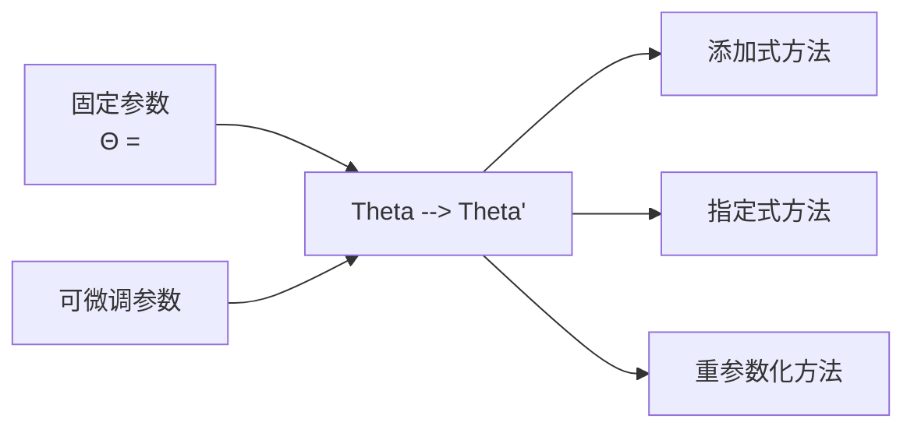
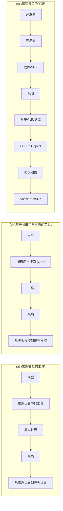
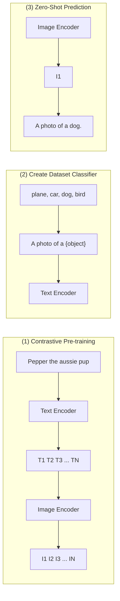
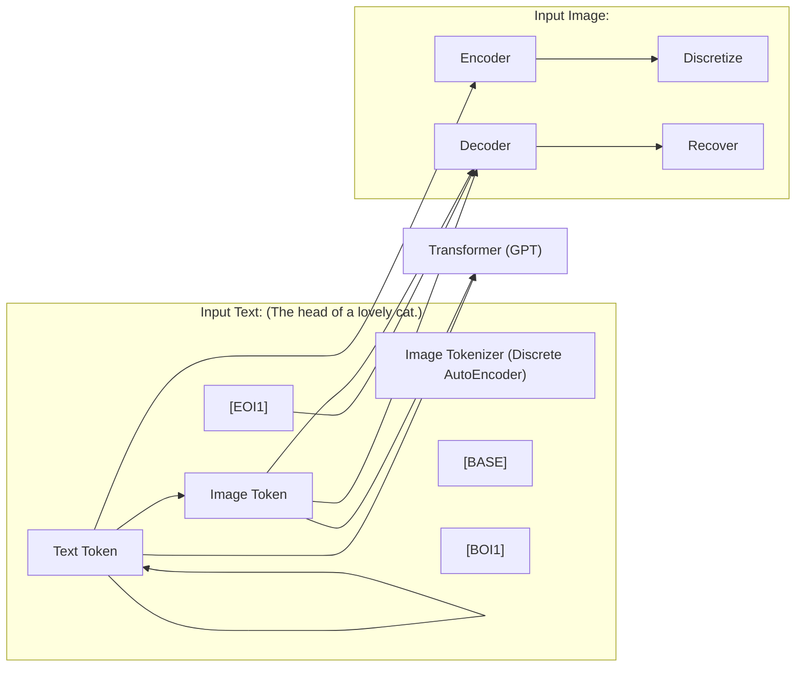
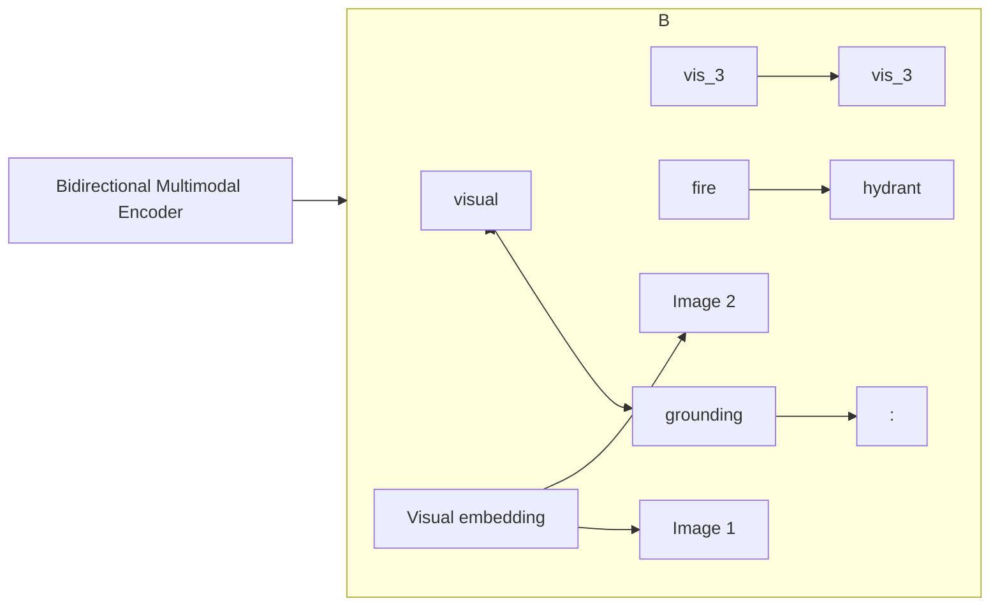
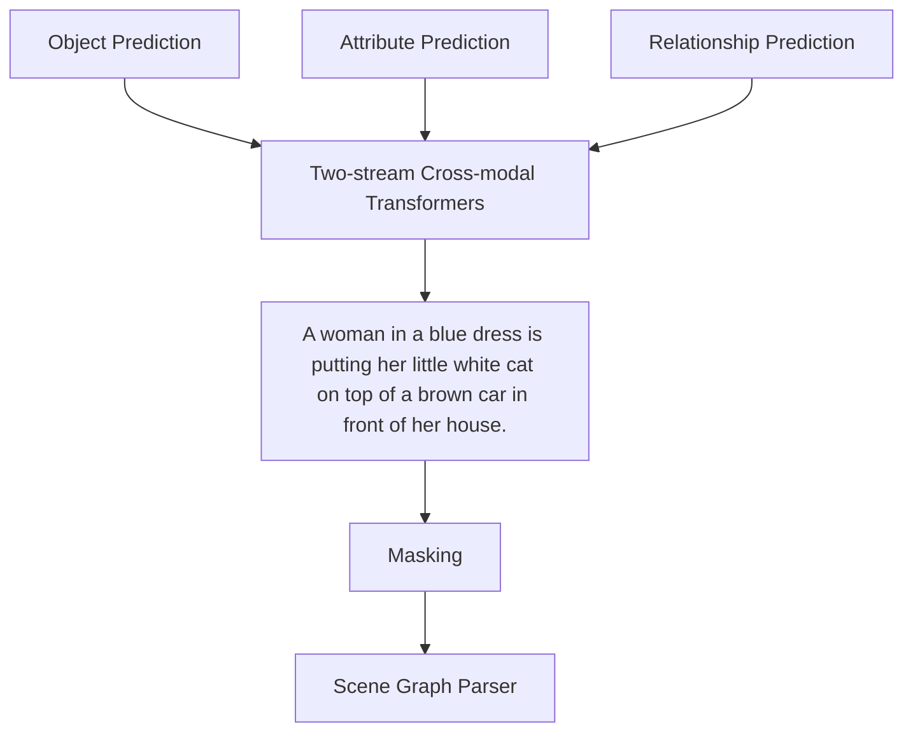
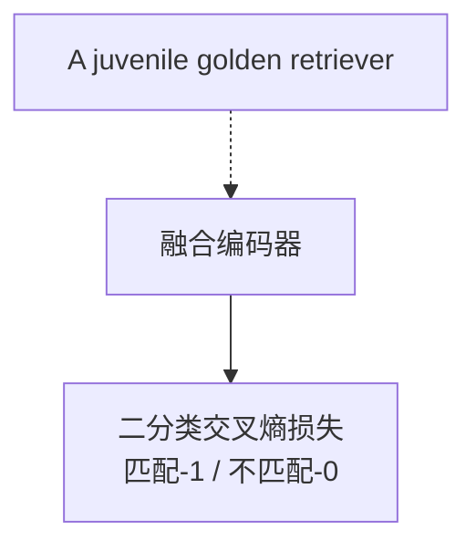
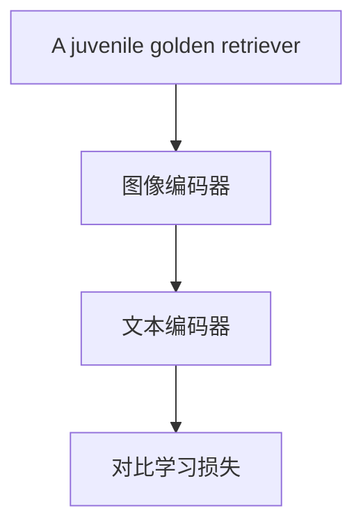

.pdf_result/images/chunk0001_94e0c71d499de652d80b9bd5675a649e8dee34c8a985c6cb7896dceca818abff.jpg)  
图 2-4 GPT-4 的可预测扩展实验[26]

高效的模型架构。BERT 之后的 Transformer 架构在提高自然语言处理效率方面有两个重要优化方向：（1）统一的序列建模，旨在将多种自然语言处理任务（如分类、信息抽取、翻译、对话等）整合到一个统一的框架，然后在同一模型中执行多个任务，以实现更高效的自然语言处理。该方法可以充分利用大规模训练数据，从而提高了模型在多个任务上的性能和泛化性。这减少了开发和维护多个单独模型的复杂性以及资源消耗，提高模型的通用性。统一任务序列建模有两种方式：一是转化为序列生成的统一任务，如 T5[42]和 BART[43]等将多种自然语言任务统一转化文本到文本的生成任务；二是转化为语言大模型预训练任务，通过语言提示在输入文本中插入人类设计或者自动生成的上下文，实现对不同任务的处理。（2）计算高效的模型架构。从 Transformer 模型架构本身在处理训练复杂度、编解码效率、训练稳定性、显存利用等方面进行优化。比如，Transformer 其并行处理机制是以低效推理为代价的，解码时每个步骤的复杂度为 O(N)，Transformer 模型也是显存密集型模型，输入序列越长、占用的内存越多。为此，微软设计了一种新的 Transformer 架构 RetNet[44]，其采用线性化注意力+尺度保持（Retention ）机制，在基本保持模型性能的基础上同时实现模型训练速度、推断速度和内存节约的大幅提升。针对自注意力显存消耗大，斯坦福大学在 Transformer 中引入FashAttention[45]，给出了一种具有IO感知，且兼具快速、内存高效的注意力算法，已经被各种主流大模型采用以扩展对超长文本输入的支持。最近，模块化大模型架构引起广泛关注，其利用大模型的神经激活稀疏性，对稠密模型进行模块化划分，不同任务只经过部分模块计 算 实 现 训 练和推 理 加 速 ， 典型工 作 包 括 Google 的 SwitchTransformers [46]和 Pathways[47]架构、清华大学的 MoEfication 架构[48]、FastMoE 架构[49]等。

.pdf_result/images/chunk0001_8c11211f5108d3b3c008a4f5dd4757c3b1145084dc727ea1a02d93d8706ad821.jpg)  
图 2-5 混合专家化的模型架构[49]

## 2.3.2 语言大模型的适配微调

语言大模型由于在大规模通用领域数据预训练通常缺乏对特定任务或领域的知识，因此需要适配微调。微调可以帮助模型更好地适应特定需求，如对敏感数据（如医疗记录）的处理，同时不暴露原始数据。此外，微调可以提高部署效率、减少计算资源需求。指令微调和参数高效学习是适配微调的关键技术。

指令微调 (Instruction Tuning)[21]，是一种可以帮助语言大模型实现人类语言指令遵循的能力，在零样本设置中泛化到未见任务上的学习方法。指令微调学习形式与多任务提示微调相似，但与提示微调让提示适应语言大模型并且让下游任务对齐预训练任务不同，其是让语言大模型对齐理解人类指令并按照指令要求完成任务，即在给定指令提示的情况下给出特定的回应，其中提示可以选择性包含一条解释任务的指令。指令微调研究涉及指令理解、指令数据获取和指令对齐等内容。

（1）指令理解，指语言大模型准确理解人类语言指令的能力，是语言大模型执行指令完成任务的前提。为了增强对指令的理解，许多工作采用多任务提示方式对基于指令描述的大量任务集上对语言大模型进行微调，如 FLAN[50]、InstructGPT[21]等，这些模型在未见的任务上显示出优越的零样本性能。

（2）指令数据获取, 指如何构建包含多样性的任务指令数据。指令数据构建常见有三种方式：i）基于公开人工标注数据构建，代表指令数据集包括 1616 种不同任务的 Super-Natural Instruction[51]、2000 种不同 NLP 任务的 OPT-IML[52]。ii）借助语言大模型的自动生成构建，如 Unnatural Instructions[53]，通过种子指令作为提示让语言大模型生成新的指令描述和问题，然后再输入到模型让其输出回答。iii）基于人工标注方法，如 ChatGPT 在人工标注指令的基础上通过GPT-3、InstructGPT 等在线平台收集用户真实指令数据。

（3）指令对齐, 语言大模型在多种自然语言处理任务上都展现了卓越的性能。然而，它们有时可能会出现不预期的行为，如创造虚假信息、追求错误目标或产生有偏见的内容[5]。其根本原因在于，语言大模型在预训练时仅通过语言模型建模，未涉及人类的价值观或偏好。为了解决这一问题，研究者提出了“指令对齐”，使语言大模型的输出更符合人类的预期。但这种对齐与原始预训练有所不同，更注重于有用性、诚实性和无害性。此外，指令对齐可能会降低语言大模型的某些通用能力，这被称为“Alignment Tax”。为实现模型输出与对人类价值的对齐，InstructGPT 提出了一种基于人类反馈的微调方法，利用了强化学习技术，将人类反馈纳入模型微调过程。实际上，ChatGPT 也采用了与 InstructGPT 相似的技术，以确保产生高质量且无害的输出。指令对齐的广泛应用，适配微调从纯数据学习的传统微调范式开始逐步向人类学习范式的转变。

参数高效微调（Parameter-Efficient Tuning）。早期以 BERT 为代表的微调方法，是在大模型基座上增加一个任务适配层，然后进行全参微调，但是这种方法存在两方面的问题：一是任务“鸿沟”问题，预训练和微调之间的任务形式不一致，这种差别会显著影响知识迁移的效能。二是高计算成本，语言大模型的参数规模不断增长，导致模型全参微调也需要大量计算资源。解决以上问题的有效途径是参数高效学习，即通过仅微调少量参数实现大模型在下游任务上获得全参微调效果。目前许多参数高效微调方法被提出，这些方法大致可分为 3 类[40]：（1）添加式方法：旨在原模型基础上引入额外的模块或参数，并仅微调该引入部分的参数。如适配器（Adapter）方法，旨将小规模的神经模块（适配器）注入到预训练模型中，并只调整这些适配器以进行模型自适应。在实际应用中，适配器模块通常分别插入在多头自注意和前馈网络子层之后，成为最广泛使用方式；（2）指定式方法：旨在原模型指定模型中部分参数为可训练参数，并固定模型其他参数。这类方法简单也十分有效，如仅通过优化模型内的偏置项并固定其他参数，模型仍然可以再现95%以上的模型全参微调性能；（3）重参数化方法：将原模型或部分模型参数重参数化到低维度参数空间中，仅仅优化低维空间中的近似参数，显著降低模型的计算量和内存消耗。如 LoRA[54]，将模型自注意力模块的变化权重参数分解为两个低秩矩阵相乘，即 。 $W = W _ { 0 } + \Delta W = W _ { 0 } + W _ { d o w n } W _ { u p }$

.pdf_result/images/chunk0001_3543bcf7d80efbf1834ca601fa4fab3e4ed1adf76642c5233257cb95f9e16ca9.jpg)

<details>
<summary>flowchart</summary>


</details>

图2-6 参数高效微调的 3 种范式[40]

参数高效微调通常具有微调参数规模小、增量式微调参数、即插即用等特点，这种技术也统一成技术框架 Delta Tuning[40]。一些围绕参数高效微调的开源工具也被研发，代表性包括 OpenPrompt[55]、OpenDelta[56]等。由于不同任务的微调参数可以被重复利用，一些关于高效微调的仓库也被构建，如 AdapterHub[57]、Delta Center[40]等。随着语言大模型的兴起，高效微调吸引了越来越多的关注，以开发一种更轻量级的下游任务适配方法。特别地，LoRA[54]已广泛应用于各种开源语言大模型（如LLaMA）以实现参数高效微调。

## 2.3.3 语言大模型的提示学习

通过大规模文本数据预训练之后的语言大模型具备了作为通用任务求解器的潜在能力，但这些能力在执行一些特定任务时可能不会显式地展示出来。在大模型输入中设计合适的语言指令提示有助于激发这些能力，该技术称为模型提示技术。代表性的提示技术有指令提示和思维链提示：

指令提示（Instruction Prompt），也称为提示学习。OpenAI 在GPT-3 [16]中首次提出上下文提示，并发现 GPT-3在少样本提示下能够达到人类水平，证明在低资源场景下非常有效，引起广泛关注。指令提示核心思想是避免强制语言大模型适应下游任务，而是通过提供“提示（Prompt）”来给数据嵌入额外的上下文以重新组织下游任务，使之看起来更像是在语言大模型预训练过程中解决的问题[10]。指令提示有三种形式：（1）少样本提示，是指在一个自然语言提示后面附加一些示例数据，作为语言大模型的输入。其可以提高语言大模型在不同领域和任务上的适应性和稳定性。少样本提示也存在一些挑战，例如如何确定合适的示例数量、如何选择示例等。（2）零样本提示，是指不使用任何示例数据，只依靠一个精心设计的提示来激活语言大模型中与目标任务相关的知识和能力。零样本提示关键问题包括如何设计合适的提示、如何选择最优的提示等。（3）上下文学习（In-context

Learning, ICL），也称情境学习，是指将一个自然语言问题作为语言大模型的输入，并将其答案作为输出[16]。情境学习可以看作是一种特殊形式的少样本提示，在问题中隐含地包含了目标任务和格式信息。情境学习可以简化问题表示和答案生成，并且可以灵活地处理多种类型和复杂度的问题。其挑战在于，如何确保问题质量、如何评估答案正确性等。

.pdf_result/images/chunk0001_f8b31400d9daf8478a4c3b5917840f57935fd9a072dbd21222d6d89938e8825c.jpg)

<details>
<summary>flowchart</summary>

```mermaid
graph TD
  subgraph n_Zero_Shot_Prompt["\"零样本提示\n(Zero-Shot Prompt)\"]"]
    Q1["回答问题:\nQ: 小红买了两盒巧克力，第一盒有15块，第二盒有20块。她决定每天吃3块，她需要多少天才能吃完?"]
  end

  subgraph n_In_Context_Learning["\"情境学习\n(In-Context Learning)\"]"]
    Q2["回答问题:\nQ: 正方形边长为5cm，其周长是多少？\nA: 答案是20cm。\nQ: 小雪有20个苹果。她吃掉了其中的1/5，她还剩下多少苹果？\nA: 答案是16。\nQ: 小红买了两盒巧克力，第一盒有15块，第二盒有20块。她决定每天吃3块，她需要多少天才能吃完?"]
  end

  subgraph n_Chain_of_Thought["\"思维链\n(Chain-of-Thought)\"]"]
    Q3["回答问题:\nQ: 正方形边长为5cm，其周长是多少？\nA: 对于正方形，所有四个边都是相等的。因此，它的周长是4×5厘米 = 20厘米。答案是20厘米。\nQ: 小雪有20个苹果。她吃掉了其中的1/5，她还剩下多少苹果？"]
  end

  Center["语言大模型"]

  Q1 --> Center
  Q2 --> Center
  Q3 --> Center
  Center --> Q1
  Center --> Q2
  Center --> Q3

  Q1 -.-> Center
  Q2 -.-> Center
  Q3 -.-> Center

  Center --> Q1
  Center --> Q2
  Center --> Q3

  Q1 -.-> Center
  Q2 -.-> Center
  Q3 -.-> Center

  Center --> Q1
  Center --> Q2
  Center --> Q3

  Q1 -.-> Center
  Q2 -.-> Center
  Q3 -.-> Center

  Center --> Q1
  Center --> Q2
  Center --> Q3
```
</details>

图2-7 几种提示样例对比

思维链（Chain-of-Thought，CoT）[58]。推理的过程通常涉及多个推论步骤，通过多步推理允许产生可验证的输出，可以提高黑盒模型的可解释性。思维链是一种提示技术，已被广泛用于激发语言大模型的多步推理能力，被鼓励语言大模型生成解决问题的中间推理链，类似于人类使用深思熟虑的过程来执行复杂的任务。在思维链提示中，中间自然语言推理步骤的例子取代了少样本提示中的〈输入，输出〉对，形成了〈输入，思维链，输出〉三元组结构。思维链被认为是语言大模型的“涌现能力”，通常只有模型参数规模增大到一定程度后，才具有采用思维链能力。激活语言大模型的思维链能力方法，在提示中给出逐步的推理演示作为推理的条件，每个演示都包含一个问题和一个通向最终答案的推理链（图 2-7）。

## 2.3.4 语言大模型的知识增强

知识运用和推理能力是衡量语言大模型智能水平的重要因素。美国Allen AI 研究大模型的问答能力，发现 GPT-3 在处理具有预设立场（false premise）的简单性常识性问题时，如类似“太阳有几只眼睛？”，GPT-3 仍然会给出“太阳两只眼睛”的荒谬回复。有效的解决方法是在深度学习模型基础上融入各类型相关外部知识。根据大模型知识融合部位不同，知识融合方法从模型输入、神经架构、模型参数、输出等不同层面，大致分为以下 4类[59]，如图2-8 所示：

.pdf_result/images/chunk0001_841d0259fb7467b755f2498686d32c6145ccba1260e5a54558b19963a09e1002.jpg)

<details>
<summary>flowchart</summary>

This diagram illustrates the knowledge integration process for artemisinin, showing how input data is processed through a target model, architecture, and knowledge support to generate knowledge shifts.
</details>

图 2-8 语言大模型知识增强的4 种途径

知识增广：从输入端增强模型，有两种主流的方法：一种方式是直接把知识加到输入，另一方法是设计特定模块来融合原输入和相关的知识化的输入表示。

知识支撑：关注于对带有知识的模型本身的处理流程进行优化。一种方式是在模型的底部引入知识指导层来处理特征，以便能得到更丰富的特征信息。例如，使用专门的知识记忆模块来从大模型底部注入丰富的记忆特征。另一方面，知识也可以作为专家在模型顶层构建后处理模块，以计算得到更准确和有效的输出。

知识约束：利用知识构建额外的预测目标和约束函数，来增强模型的原始目标函数。例如，远程监督学习利用知识图谱启发式标注语料作为新的目标，并广泛用于实体识别、关系抽取等系列 NLP 任务。或者利用知识构建额外的预测目标，在原始语言建模之外构建了相应额外的预训练目标。

知识迁移：模型知识作为重要的知识来源，也可以直接用于下游任务，例如初始化模型参数。迁移学习和自监督学习都是知识迁移的重要研究方向。目前，知识迁移技术已被广泛应用于自然语言处理，以BERT 为首的各种预训练模型是现在知识迁移的主要方法。

## 2.3.5 语言大模型的工具学习

语言大模型具备理解、推理和决策能力，可与外部工具互动。在特定领域任务中，如金融领域的证券交易和市场预测，语言大模型通常需要结合外部工具获取信息和技能才能处理。整合外部工具与语言大模型可以发挥各自优势实现复杂任务的处理，其中外部工具可增强专业知识和可解释性，语言大模型提供语义理解和推理规划能力。

2021 年底，OpenAI 推出 WebGPT[60]，利用 GPT-3 与网页浏览器和搜索引擎交互获取互联网信息在长文本问答上实现非常强的能力，展现了语言大模型利用工具解决复杂问题的巨大潜力。该工作引起了学术界和产业界的广泛关注，产生了许多面向不同任务或场景需求的大模型调用工具的方法，如 Webshop[61]，使用语言大模型替代人在购物平台上执行一系列操作、购买所需物品。2023年3月，OpenAI发布 ChatGPT Plugins[62]，实现 ChatGPT 调用各种外部插件的功能，支持浏览器实时信息获取、代码解释器、PDF 阅读等能力，截至 8月已支持 480 个常用工具插件。Meta 将这种通过非参数的外部模块扩展语言大模型能力的方法，统一称为增广语言模型（AugmentedLanguage Models）[63]。清华大学在现有大模型工具使用方法基础上，提出了工具学习（Tool Learning）框架[24]，指在让模型能够理解和使用各种工具完成任务的学习过程。

.pdf_result/images/chunk0001_ac6c8d2202c5699256abce3bbd994e32171621dc48fdbb80cf7428fa535f5f59.jpg)

<details>
<summary>flowchart</summary>


</details>

图 2-9 基于用户接口视角的工具分类[24]

目前可交互的通用工具按用户接口大致可分为三类（图2-9）：物理交互的工具（如机器人、传感器等）、基于图形用户界面的工具（如浏览器、Office办公软件等）、基于编程接口的工具（如数据库、知识图谱）等。从学习目标的角度来看，现有工具学习方法主要可以分为两类[24]：一类是工具增强学习（Tool-augmented Learning），利用各种工具的执行结果，增强基础模型性能。在这一范式中，工具执行结果被视为辅助生成高质量输出的外部资源；第二类是工具导向学习（Tool-oriented Learning），将学习过程重点从增强模型性能转向工具执行本身。这一类研究关注开发能够代替人类控制工具并进行序列决策的模型。

## 第 3 章 多模态大模型技术

不同于语言大模型只对文本进行处理，多模态大模型将文本、语音、图像、视频等多模态数据联合起来进行学习。多模态大模型融合了多种感知途径与表达形态，能够同时处理和理解来自不同感知通道（例如视觉、听觉、语言和触觉等）的信息，并以多模态的方式表达输出。

## 3.1 多模态大模型的技术体系

现有的多模态大模型主要有面向理解任务的、面向生成任务的、兼顾理解和生成的、知识增强的多模态大模型。

## 3.1.1 面向理解任务的多模态大模型

面向理解任务的多模态大模型，其核心结构通常是基于Transformer 的编码器。按照模型结构的不同，面向理解任务的多模态大模型又可再分为单流和多流两种结构。单流结构是指不同模态的特征在拼接后由一个共享的 Transformer 网络进行处理；而多流结构中，不同模态则分别由 Transformer 网络进行编码处理，这些网络之间存在有一些特征上的交互融合机制。

多流结构的一个典型代表是图文理解模型 ViLBERT[64]，它采用了一种双流Transformer 的结构，首先将文本和图像数据分别输入两个独立的 Transformer 编码器，接着使用互注意力 Transformer（Co-AttentionTransformer）层将文本和图像特征进行融合，最后所得到文本-图像特征可以被应用到视觉问答、图像描述生成等不同的多模态的任务中。多流结构的另一个代表是 OpenAI公司的CLIP[65]模型，它采用两个独立的编码网络对图像和文本进行特征抽取，并通过对比学习将两者的特征嵌入到共享的语义空间中。CLIP 基于 4 亿图文对进行训练，可以从自然语言监督中有效地学习视觉概念，从而获得泛化性能极强的零样本（zero-shot）分类能力。另一个与 CLIP 类型的代表性方法

ALIGN[66]，使用对比损失训练了一个简单的双编码器模型，利用包含超过10亿个噪声图像-文本对的数据集来扩展视觉和视觉语言表征学习。CLIP 是个图文双流结构，而 VATT[67]则是针对视频-文本-音频数据的多流模型。与 CLIP 类似，VATT 将每个模态线性投影为特征向量，然后将其分别送到 Transformer 编码器中，并将编码后的特征在语义分层的不同粒度空间中通过对比学习来训练模型。

.pdf_result/images/chunk0001_a00aebdfbab76d8d992d6c432237abe96d767b094c986ecd16bc3540d85ab641.jpg)

<details>
<summary>flowchart</summary>


</details>

图 3-1 CLIP[65]模型架构图

单流结构的一个典型代表是 VL-BERT[68]，它将图像的描述文本和关键物体的区域特征拼接后作为BERT 网络的输入，通过掩码掉部分文本输入和图像输入并预测所缺失的信息来进行模型训练。此外，另一代表性方法UNITER [69]，则采用了一种多任务的多模态预训练方法，相对于其它方法，该模型增加了单词与图像区域的匹配模块，来更进一步建立图像与文本的细粒度关联。在视频领域，单流结构的代表性方法有 VideoBERT[70]和 ActBERT[71]，其中 VideoBERT 是一个视频-语言模型，它融合了文本和视频作为 BERT 网络的输入；而ActBERT 采用了一种全局-局部关系的建模方法，输入不止包括文本和视频的全局信息，还利用了视频帧中的局部信息来加强对于视频内容的理解。

现有的面向理解任务的多模态大模型大多都以上面两类结构为基础，此外，也有不少方法在预训练任务上进行研究，引入更多的预训练任务或设计统一的架构去训练所有的任务等。例如，其中一个典型方法 Florence[72]，它着重于如何使模型适应各种下游任务，并设计了一个由多模态大模型和适应模型组成的工作流。具体对于任务适应，该模型使用动态头部适配器将学习到的视觉特征表示从场景扩展到对象，采用 CoSwin 适配器来学习视频表示，并使用 METER适配器将模型应用到依赖细粒度视觉-语言表示的视觉语言任务。

## 3.1.2 面向生成任务的多模态大模型

面向生成任务的多模态大模型能够实现文本、图片、视频、音频、3D、分子结构等多种模态内容的生成应用。目前常用的方法主要是基于序列生成模型和扩散模型（diffusion models）。

在序列生成模型中，DALL-E[73]是个典型代表。它是由OpenAI发布的一个基于 4 亿图文对训练的图像生成模型，通过采用VQVAE[74]图像离散自编码器和 GPT 组合的结构，在以文生图任务上取得了突破性的生成质量和泛化能力，被称作图像版GPT。另一典型的图像生成模型是北京智源研究院所的 CogView 模型[75]（如图3-2 所示），它具有与 DALL-E 类似的结构，但是面向中文环境的文本到图像生成，并进一步探索了多模态生成模型在下游任务上精调后的泛化能力。CogView 在基于文本控制的样式学习、服装设计和图像超分等任务上均取得出色的效果。在文本生成方向上，采用序列生成模型是最主流的方案，例如，典型方法 GIT[76]是一个视觉到文本的多模态大模型，统一了图像/视频的描述和问答等视觉语言任务，它包含有一个图像编码器和一个文本解码器，其文本解码器在视觉编码的基础上，以自回归的方式来生成文本。

.pdf_result/images/chunk0001_76b6d69fa06a30219da27f7378d2999cd6189c1cd15433f28fae31b94667ef6b.jpg)

<details>
<summary>flowchart</summary>


</details>

图 3-2 CogView [75]模型架构图

扩散模型的工作原理，是通过连续添加高斯噪声来破坏训练数据，然后通过反转这个噪声过程，来学习恢复数据。扩散模型的一个代表性方法LDM[77]，它先压缩图像的像素信息来获取图像对应的隐特征表达，再采用扩散模型来建模图像隐特征分布。另一典型扩散模型Stable Diffusion，它拓展 LDM 至开放领域的文本至图像生成，是当前开源模型的代表方法。除了开源模型之外，闭源的扩散模型中代表性方法有 OpenAI 的 DALL-E2[78]与谷歌的 Imagen[79]。其中，DALL-E2首先然练一个扩散解码器来反转 CLIP图像编码器，然后训练一个独立的映射模型将 CLIP 模型的文本特征映射到图像特征空间，从而实现以文生图的过程，并极大提升了生成图像与输入文本的匹配程度。而 Imagen 首先将文本进行编码表征，之后使用扩散模型将表征映射成为64x64 像素的低分辨率的图像，然后会通过两个超分辨率扩散模型来逐渐提高分辨率到1024x1024 像素，如图3-3所示。此外，与 DALL-E2 不同的是，Imagen 使用了通用语言大模型 T5 模型直接编码文本信息，然后直接用该文本编码来生成图像；同时，Imagen 发现基于 T5 模型提取的文本特征生成的图像比基于 CLIP 模型的图像细节准确度更高。

.pdf_result/images/chunk0001_37bedc872bed20b9f49554e74b5125d780bb8889846bcd4d63f0d932257a5660.jpg)  
图 3-3 Imagen[79]模型架构图

## 3.1.3 兼顾理解和生成任务的多模态大模型

Transformer 编码器通过双向的注意力机制来学习对数据的理解能力，而解码器通过单向的注意力机制学习生成能力。为了让模型同时具备这两种能力从而可以在更广泛的下游任务上应用，可以联合Transformer 编码器与解码器，设计能够兼顾理解与生成任务的多模态大模型。例如，一个典型方法是蒙特利尔大学所的VL-T5[80]模型，将多个多模态任务统一为文本生成任务。具体地，如图3-4 所示，该模型由 Transformer 编码器和自回归的解码器组成，其主要创新点在于针对训练任务与数据的不同采用不同的输入文本与输出文本的构造方式，这种将模型结构和目标任务统一的方法可以充分利用不同任务的数据来训练模型，提高模型的泛化性。这类方法的另一个典型模型 Unified VLP[81]，它的主要特点是编码器和解码器共享同一个Transformer 网络。该方法通过设置注意力掩码来控制网络为编码器或解码器。具体地，当使用编码器时，注意力掩码为双向掩码，任一位置都可建模前后两个方向的依赖关系；当使用解码器功能时，注意力掩码设置为单向，每一位置只能建模前文的依赖关系。这种编解码共享的方式能够减少参数量，使网络更加简洁。

.pdf_result/images/chunk0001_3352ee81fad45348b60cc990862317f61884d170cf20d233c759698ba469bacc.jpg)

<details>
<summary>flowchart</summary>


</details>

图 3-4 VL-T5[80]模型架构图

此外，还可以将语言大模型的文本生成能力与各类模态编码器的多模态感知能力相结合，以此构建的多模态大模型也能够兼顾理解和生成能力。这类方法以语言大模型为主导来实现多模态的对齐、融合和交互。这是由于文本有高效的表达效率、能够通过语义描述的方式与其余所有模态建立直接的联系，另外，语言大模型在预训练过程中学习到了非常多的世界知识，有潜在理解多模态信息的能力。这类模型在结构方面常由单模态编码器、连接器与语言大模型三部分组成，其中单模态编码器和语言大模型的参数可以冻结以减少计算量、提高训练效率；连接器常见的有简单的线性映射层，或者特殊设计的网络模块如 BLIP-2[82]中的 Q-former 结构等（如图 3-5 所示）。这类模型通常涉及到两个阶段的训练过程。在第一阶段，训练各个模态到语言大模型的语义对齐，通常利用大规模弱关联的跨模态数据（如图像-文本、视频-文本、音频-文本数据等），基于条件文本生成任务进行训练。在第二阶段进行多模态指令微调以提升零样本多模态能力，此阶段的核心是构造面向多模态任务的指令微调数据，目前常见的多模态指令微调数据类型有多模态对话、多模态详细描述与多模态推理问答等。

.pdf_result/images/chunk0001_2ef1ddf0490ce3619c8e2116d0f1e611f43ace217b41d0ba21eb9ee71df28884.jpg)

<details>
<summary>flowchart</summary>

```mermaid
graph LR
  InputImage["Input Image"] --> Encoder["Image Encoder"]
  Encoder --> QFormer["Q-Former"]
  QFormer --> QueryLayer1["Queries"]
  QFormer --> InstructionLayer1["Instruction"]
  
  subgraph QFormer
    direction TB
    FeedForward1["Feed Forward"]
    CrossAttention["Cross Attention"]
    SelfAttention["Self Attention"]
    FeedForward2["Feed Forward"]
  CrossAttention --> FeedForward2
  SelfAttention --> InstructionLayer2["Instruction"]
  FeedForward1 --> QFormer
  FeedForward2 --> SelfAttention
  end
  
  subgraph Instruction
  InputImage --> InstructionLayer1
  InstructionLayer1 --> FullyConnected["Fully Connected"]
  FullyConnected --> LLM["LLM"]
  LLM --> ResponseLayer1["Response"]
  ResponseLayer1 --> LeftOne["left one"]
  end
```
</details>

图 3-5 BLIP-2[82]模型架构图

## 3.1.4 知识增强的多模态大模型

大模型不仅对大规模数据有着卓越的拟合能力，还能够学习到隐式的知识。为了促进更有意义的理解和预测，还需要寻找将隐式知识与显式知识（例如来自知识图谱）联系起来的方法。因此，将知识图谱、场景图、外部知识库等结构化的知识信息注入大模型中，将可增强多模态大模型的知识利用能力。例如，在场景图知识的利用上的一个典型方法是百度的 ERNIE-ViL[83]模型，如图3-6 所示，它在视觉-语言模型中引入了由文本解析而来的场景图信息，在预训练过程中通过将场景图中的知识实体和关系进行掩码后要求模型预测所掩码位置的知识信息，以此作为更细的多模态预训练任务，这能够使得模型更能精准把握图像和文本之间细粒度的对齐信息。在知识图谱的利用上，典型方法有KRISP[84]，它结合了隐含知识和明确知识的学习，即从无监督语料和有监督的训练数据中学到隐含的知识，从结构化数据知识图谱中学习明确的符号化的知识，这样既可以进行隐式的知识推理，又可以获取符号化的知识表示。

.pdf_result/images/chunk0001_dcbb78e821c44e53008b8880d58feb7a6d70c4b0320c138897634a57557e9909.jpg)

<details>
<summary>flowchart</summary>


</details>

图 3-6 ERNIE-ViL[83]模型架构图

## 3.2 多模态大模型的关键技术

多模态大模型的关键技术主要包括预训练数据收集、基础模型构建、自监督学习与模型优化训练、下游任务微调。

## 3.2.1 多模态大模型的网络结构设计

网络架构在多模态预训练中扮演着关键角色，需要精心设计以适应和理解来自不同源的复杂特征。例如，在处理图像和文本模态时，通常会采用 Transformer 或卷积神经网络（CNN）来捕捉视觉和语言之间的复杂关系；而对于事件流，脉冲神经网络可能更为适合，因为它们能有效地模拟信息的时序动态。随着模型规模的增加，大型多模态大模型展示出强大的记忆能力和性能增益。然而，模型复杂度的增加也不可避免地引入了计算效率的挑战，并可能最终遇到性能瓶颈。因此，对于更高效的网络模型结构的设计和探索，比如改进或甚至替代Transformer，成为了重要的研究方向。

其次，得益于语言大模型涌现出的知识与逻辑推理能力，近期有一系列多模态大模型开始以语言大模型为核心进行构建。其中一个代表性方法是 DeepMind 的 Flamingo[85]视觉语言模型，该模型能够将图像、视频和文本作为提示并输出相关语言回复。它将视觉编码器与语言大模型的参数冻结并通过可学习的融合模块联系起来，模型采用

20 多亿对图片-文本、270万对视频-文本，与430 万图文混排的网页数据进行视觉-语言联合训练；Flamingo 具有少样本（few-shot）的多模态序列推理能力，无需额外训练即可完成视觉语义描述、视觉问答等多种任务。另一个代表性模型 KOSMOS-1[86]，它将一个基于Transformer 的语言模型作为通用接口，并将其与视觉感知模块对接，使得模型“能看”和“会说”；该模型具有 16 亿参数量，在大规模多模态语料库上训练，具有遵循指令（即零样本学习）以及在上下文中学习（即少样本学习）能力，能够原生处理视觉对话、视觉问答、图像描述生成、光学字符识别等任务。此外，近期还有一系列模型尝试将图像、视频等感知模块与 LLaMA[87]等开源的语言大模型对接，从而实现类似 GPT-4 的多模态理解能力。其中的一个典型模型是ChatBridge[88]，它使用多个并行的感知模块用来处理包括图片、音频、视频的在内特征，然后通过少量预训练参数将这些模态的特征投影至语言大模型的语义空间，使得模型具备灵活感知、理解混合模态信息的能力。

最后，对于多模态预训练，设计与下游任务更高兼容性的网络结构模型显得尤为重要。具体来说，可以通过引入编码器-解码器结构将多模态理解和生成任务统一到一个框架下，从而更好地支持各种多模态任务。这主要涉及到跨模态的注意机制、模态间的对齐和翻译、以及更复杂的特征集成策略。

## 3.2.2 多模态大模型的自监督学习优化

以视觉-语言数据的联合学习为例，多模态大模型常用的自监督学习任务通常有以下几种类型。

1）掩码语言建模（Masked Language Modeling，MLM）：输入文本序列中的某些单词或标记会被替换为特殊的掩码标记[MASK]，然后预训练模型被要求根据可见的多模态上下文来预测这些被遮蔽的单词或标记，如图 3-7。多模态大模型通过执行这种预训练任务，模型能够在大规模文本数据上获取深层次的语言理解，从而更好地执行下游自然语言处理任务，如文本分类、命名实体识别、句子相似性计算等。

.pdf_result/images/chunk0001_a3a9c7c83204cc67f1a5774c94778b8eff376f3092cc9a0e3ebc71e1f07162a7.jpg)

<details>
<summary>text_image</summary>

dog
couch
融合编码器
a [mask] is sitting on a [mask]
</details>

图3-7 掩码语言预测

2）掩码图像建模（Masked Image Modeling，MIM）：输入图像中的部分区域会被隐藏或被替换为特殊的掩码标记[MASK]，然后预训练模型被要求在仅看到其余图像内容与文本等其他模态信息的情况下，预测或还原被遮蔽的图像区域。多模态大模型通常使用这种训练方式促使模型学习图像的视觉特征、多模态上下文信息和语义关系，以更好地理解图像内容，如图3-8。

.pdf_result/images/chunk0001_b83691973da7bb790620276e145de1b1d111bf55df0ed3f7b7a1d363e0a3af93.jpg)

<details>
<summary>text_image</summary>

融合编码器
[mask]
[mask]
a dog is sitting on a couch
</details>

图3-8 掩码视觉预测

3）图像-文本匹配（Image-Text Matching，ITM）：前面的掩码语言建模和掩码图像建模旨在建立图像与文本的细粒度对齐，而图像-文本匹配任务是旨在实现图像与文本的全局对齐。通常给定图文对作为正样本，随机配对作为负样本对，然后通过二分类方法实现图像和文本的匹配，从而建立图像和文本之间的语义关联，如图 3-9。

.pdf_result/images/chunk0001_b02e169a5c8c1939aea257b6a6ff632cff160f843c0884160e7c53292b674f74.jpg)

<details>
<summary>flowchart</summary>


</details>

图3-9 图像文本匹配

4）图像-文本对比学习(Image-Text Contrastive Learning, ITC），使用对比学习的方法将图像和文本的相同样本对的向量表示拉近，不同样本对的向量表示推远，从而增强图像和文本之间的语义关联性。这使得模型能够更好地理解图像和文本之间的语义关联，为多模态任务提供更好的表示能力，如图 3-10。

.pdf_result/images/chunk0001_634affba5cca6c5995008761cd389a18b663633bdbe95459e68ad54cf265c2e3.jpg)

<details>
<summary>flowchart</summary>


</details>

图3-10 图像-文本对

## 3.2.3 多模态大模型的下游任务微调适配

多模态大模型的最终目标是适配并提升特定下游任务上的性能表现，因此，需要通过微调适配将预训练大模型的能力迁移到特定数