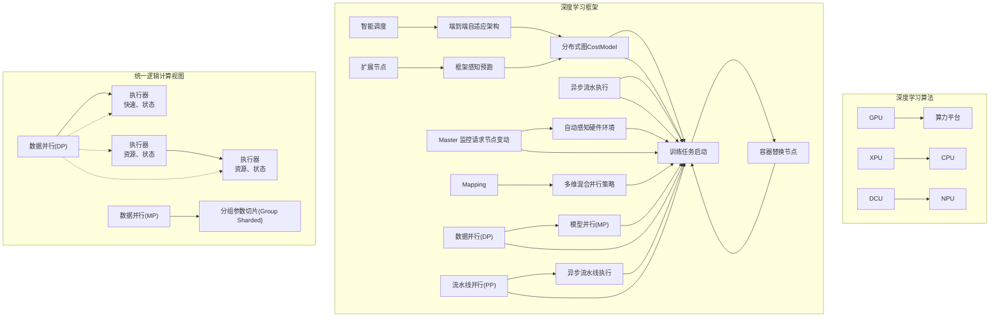
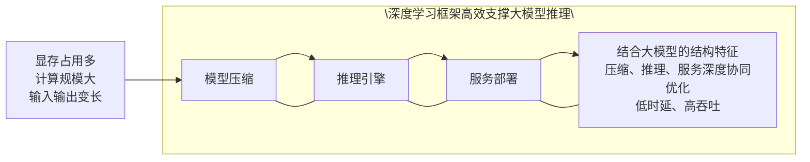
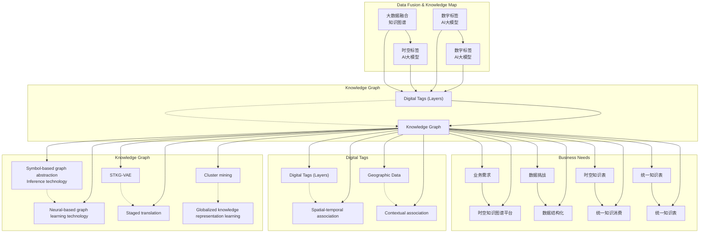
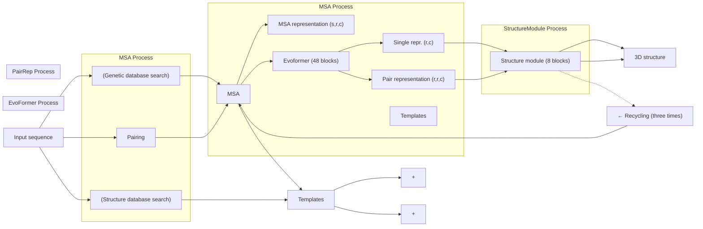
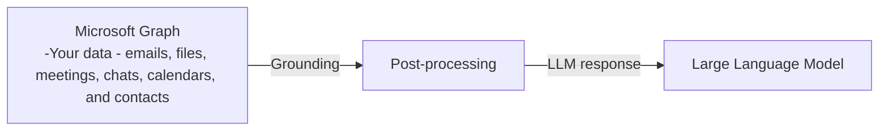
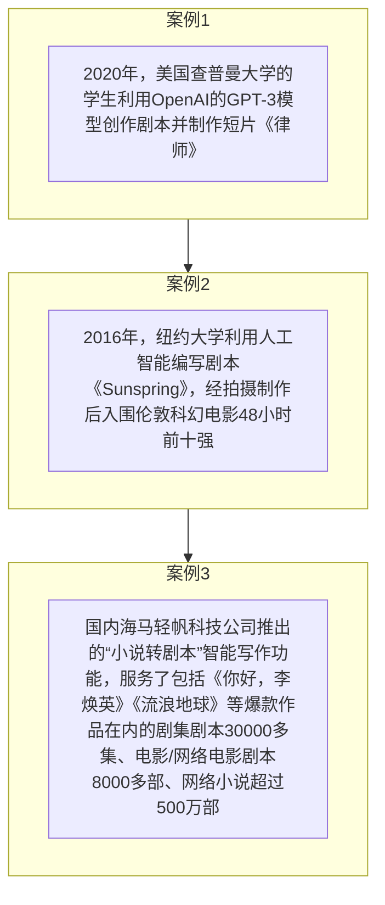

数据并行，也支持模型并行，包括 Tensor 并行和 Pipeline 并行两种模 型 并 行 方 式 。 同 时 提 出 了 更 加 精 细 的 pipeline 结 构 与communication 模式。通过多种并行方式的结合，可以让大模型的训练更快。将核心操作 LayerNorm 和 Dropout 安装输入维度进一步切分，使得这两个需要频繁运行的操作在不大幅增加通信开销的情况下实现了并行。

DeepSpeed：在 2021 年 2 月 份 ， 微 软 发 布 了 一 款 名 为DeepSpeed[29]的超大规模模型训练工具，其中包含了一种新的显存优化技术——零冗余优化器 ((Zero Redundancy Optimizer, ZeRO）。该技术去除了在分布式数据并行训练过程中存储的大量冗余信息，从而极大地推进了大模型训练的能力。从这个角度出发，微软陆续发布了ZeRO-1，ZeRO-2，ZeRO-3 和 ZeRO-3 Offload，基本实现了 GPU 规模和模型性能的线性增长。基于DeepSpeed，微软开发了具有 170亿参数的自然语言生成模型，名为 Turing-NLG。2021 年月，推出了能够支持训练 2000 亿级别参数规模的 ZeRO-2。目前最新版本 ZeRO-3Offload 可以实现在512 颗V100 上训练万亿参数规模的大模型。

## 4.4 大模型的训练数据

数据是大模型的关键要素，其所需的数据的种类也非常广泛，涉及多种模态。以语言大模型为例，其所需要的数据包括多语言数据、代码数据、人工标注数据等多种类别。

## 4.4.1 大模型的训练数据处理流程和特点

根据大模型训练的尺度定律（scaling law），数据规模、模型参数与大模型性能存在紧密关系。近期，微软研究工作表明提高数据质量可以极大地改变尺度定律的形状。通过构建 7B的小规模“教科书（Textbooks）”高质量的代码训练数据（包括从web 上筛选的“教科书质量”数据（6B tokens）以及使用GPT-3.5 生成的教科书和练习（1Btokens）），训练 1.3B 模型 phi-1 在代码评测集 HumanEval 上 Pass@1准确率达到了 50.6%，超越 GPT-3.5（175B，超过 2TB 训练数据）的47%。该方法表明，通过构建高质量的数据，可以大大降低大模型训练需要的数据规模，具有重要指导意义。下面是几类用于提升数据质量的预处理方法[119]。

质量过滤：语言大模型训练中需要过滤低质量数据，主要分为两类方法：基于分类器的方法和基于启发式的方法。基于分类器的方法是训练一个文本质量判断模型，用以识别并过滤低质量数据。例如，GPT3、PaLM[17]和 GLaM[120]模型在训练数据构造时都使用了基于分类器的方法。而基于启发式的方法则是通过一组精心设计的规则来消除低质量文本，主要包括语言过滤、指标过滤、统计特征过滤和关键词过滤，如BLOOM 和Gopher[121]都采用了基于启发式的方法。

冗余去除：语言大模型训练语料库中的重复数据会影响模型性能，降低语言大模型的多样性，并可能导致训练过程不稳定。因此需要对数据进行冗余去除。文本冗余发现（Text Duplicate Detection）也称为文本重复检测，是自然语言处理和信息检索中的基础任务之一。该方法用于数据处理可以发现不同粒度上的文本重复，包括句子、段落以及文档等不同级别，可以有效改善语言模型的训练效果。

隐私消除：预训练数据中可能包含涉及敏感或个人信息，增加隐私泄露的风险。对于此类问题，最直接的方法是采用基于规则的算法删除隐私数据。例如可以使用基于命名实体识别的算法，检测数据中姓名、地址和电话号码等个人信息内容，并进行删除或者替换。这种方法使用了基于Transformer 的模型，并结合机器翻译技术，可以处理超过100 种语言的文本，消除其中的隐私信息。

当前，大模型训练不仅需要大量的无标注数据，而且也需要高质量的人工标注数据，用于模型微调等任务。语言大模型通常需要人类提供明确的指令用于生成有用的输出，标注者通常需要编写提示，典型的提示类型包括如下几种[122]：

普通提示（Plain）：这种类型的提示是为了确保模型的多样性。标注人员需要设计一系列任务，并确保任务具有足够的多样性，以便模型能够了解不同类型的问题和请求。  
 少量样本提示（Few-shot）：这种类型的提示需要标注人员设计一个指令以及该指令的多个查询/响应对。这些示例应该是常见任务或指令，并且应该涵盖各种不同的主题和情境。  
 基于用户的提示（User-based）：这种类型的提示需要标注人员根据用户使用案例来编写提示。这些使用案例很有可能是源于用户的实际需要，因此标注人员应该尽可能准确地描述任务和需求。

基于上述收集的数据和提示信息，需要准备三类数据集用于不同训练阶段[122]：

SFT数据集，标注人员会根据输入的提示给出一些符合需求的示例结果，然后在这些数据上进行有监督学习。  
 RM数据集，对同一个输入，模型会给出多个输出结果，标注员会标注各个结果好坏的排序，然后在这个基础上训练一个奖励模型。  
 PPO数据集，没有任何人类标签，用作强化学习的输入。

在数据构建任务中，随着数据量不断增长，需要开发自动化算法来简化流程。例如，数据增强等环节的自动化受到越来越多的关注。这些任务的自动化不仅会提高效率，而且会提高准确性。此外，自动化可以促进人工标注结果的一致性。

多模态大模型需要有大规模的多模态训练数据，这类数据的收集与处理难度相比于单模态数据更大，需构建以低代价挖掘并实现不同模态之间对齐的高质量多模态数据的方法。未来还需要重点考虑的问题包括：如何构建大模型数据质量评价体系、如何科学地配比训练数据、以及如何在训练不同阶段引入数据等。

## 4.4.2 大模型常用的公开数据集

当前已经出现一批大模型数据集，涵盖多种模态。代表性的数据集既包括 ALIGN[66]、VAST-27M[123]、WebVid-2.5M[124]等多模态数据集，还包括 BookCorpus[125]、Common Crawl[126]、HH-RLHF[127]等语言大模型数据集。

表1 大模型常用的公开数据集

<table><tr><td>数据集类型</td><td>数据集名称</td><td>数据量和简介</td></tr><tr><td rowspan="4">语言大模型预训练数据集</td><td>BookCorpus</td><td>2.24G,包括超过11 000本电子书,涵盖广泛的主题和类型(如小说和传记)。</td></tr><tr><td>OpenWebText[126]</td><td>38G,从Reddit上共享的URL中提取的Web内容,且至少获得了3次赞成。</td></tr><tr><td>Common Crawl</td><td>PB级规模,一个大型网站抓取数据集,包含原始网页数据、元数据提取和文本提取等内容。</td></tr><tr><td>The Pile[127]</td><td>825G,一个大规模、多样化、开源的文本数据集,内容包括书籍、网站、代码、科学论文和社交媒体平台等。</td></tr><tr><td rowspan="2">语言大模型指令微调数据集</td><td>Stanford Alpaca[128]</td><td>21.7M,开源的SFT的多样化数据集,包含52 000条指令数据,涵盖创作、生成、设计、代码等多个维度。</td></tr><tr><td>static-hh[129]</td><td>90M,开源的SFT多样化数据集,包含100 000条人类对话数据,由LAION、Together、Ontocord.ai这三个机构共同制作,用于对话相关大模型训练。</td></tr><tr><td></td><td>ShareGPT[130]</td><td>1.8G, ShareGPT 数据集是一个由用户共享的对话 SFT 数据集, 包含了超过 1 亿条来自不同领域、主题、风格和情感的对话样本, 涵盖闲聊、问答、故事、诗歌、歌词等多种类型。</td></tr><tr><td rowspan="3">语言大模型强化学习微调数据集</td><td>HH-RLHF</td><td>120M, Anthropic 创建的大型 RLHF 训练数据集, 包含 161 000 条人工标注的数据。标注人员首先选择自己能够忍受的攻击主题, 然后与模型进行对话。每次给标注人员的会是由两个随机由模型生成的结果, 标注人员需要从两个选项中选择出哪一个更有害, 因此来构建人类反馈的数据。</td></tr><tr><td>zhihu_rlhf_3k[131]</td><td>16M, 知乎开源的 RLHF 数据集, 包含 3 000 条基于知乎问答的人类偏好数据, 包含每个问题中赞同数据较高(chosen)和较低(rejected)的回答, 可以用于奖励模型的训练。</td></tr><tr><td>BeaverTails[132]</td><td>52M, 北京大学开源的 RLHF 数据集, 包含 302 000 个数据对, 覆盖 7 774 个问题。主要标注的方向包含 helpful 和 harmless 两个维度。</td></tr><tr><td>图片-文本多模</td><td>SBU[133]</td><td>1M, 图片-标题对</td></tr><tr><td rowspan="5">态数据集</td><td>COCO [134]</td><td>330K,图片/1.5M 标题</td></tr><tr><td>Visual Genome[135]</td><td>108K,图片-标题对</td></tr><tr><td>Conceptual [136]</td><td>12M,图片标题对</td></tr><tr><td>ALIGN</td><td>1.8B,图片-标题对</td></tr><tr><td>COYO-700M[137]</td><td>747M,图片-标题对</td></tr><tr><td rowspan="4">视频-文本多模态数据集</td><td>HowTo100M[138]</td><td>136M,视频标题对/134 500 小时</td></tr><tr><td>WebVid-2.5M</td><td>2.5M,视频标题对/13 000 小时</td></tr><tr><td>YT-Temporal-180M [139]</td><td>1.8M,视频标题对</td></tr><tr><td>HD-VILA-100M[140]</td><td>100M,视频-标题对</td></tr><tr><td rowspan="2">图文音多模态数据集</td><td>VALOR-1M[141]</td><td>1M,视频-音频-文本数据组</td></tr><tr><td>VAST-27M</td><td>27M,视频-音频-字幕-文本数据组</td></tr></table>

## 第 5 章 大模型的开发训练与推理部署

随着参数规模和网络结构复杂性的不断提升，大模型开发、训练和推理部署所面临的挑战愈发严峻，其研发依赖算法、算力和数据的综合支撑。深度学习框架及配套工具为大模型的生产和应用提供了基础支撑，涉及开发、训练、压缩、推理和服务等多个环节。此外，通过深度学习框架还可以实现与硬件的适配和协同优化，进一步提升硬件的计算和推理性能，降低大模型开发和应用的成本。

## 5.1 大模型开发与训练

由于大模型参数规模大，计算和存储的需求显著增加，与辨别式AI 模型相比，非常依赖分布式技术提升效率。因此，大模型开发的挑战集中体现在基于深度学习框架对各类分布式并行策略进行本地化配置。为了支持各种分布式并行策略，需要有一套简单、灵活、高效且易于使用的框架和工具界面，使用户可以快捷地进行模型训练和调优，并方便地配置和管理大规模的并行任务。大模型开发也离不开高效的调试工具及方法支撑，非常依赖动态图的调试机制、清晰的调试日志和可视化的调试界面等，帮助开发人员更好地分析模型的行为和表现。

大模型的高性能训练旨在通过对模型计算、显存、内存和通信的系统级优化，在保证模型收敛性的前提下，提高训练吞吐量，实现在有限资源下大模型高效训练的目的。系统级优化方法主要从两个方向实现：一是设备内优化方法，包括降低浮点数的冗余表示的半精度浮点优化、混合精度浮点优化[79]等方法、降低梯度计算过程中冗余表示的梯度检查点（Checkpointing ） 方 法 ， 以 及 内 存 优 化 的ZeRO-Offload[142]方法，即通过将数据和计算从 GPU 卸载到 CPU，以减少神经网络训练期间 GPU 内存占用的方法。二是多设备优化方法，也称分布式优化，即将分布在不同计算节点上的多个 GPU 一起用于训练单个模型，这类方法主要有数据并行、张量并行、流水线并行、分组参数切片并行等多种并行加速策略，下面进行重点介绍。

数据并行[143]：数据并行是每个处理器存储全量的模型参数、梯度和优化器状态，但读取不同的输入数据，在反向计算出参数梯度后，对参数梯度做AllReduce 聚合，然后每个处理器独立进行参数更新。数据并行的优点是实现和使用方式简单，可以通过增加数据并行路数提高训练吞吐，是目前最为常用的分布式并行策略之一。

张量并行[118]：张量并行是将神经网络中同一层的张量运算拆分成多个独立的子运算，并相应地对模型参数做切分，由不同的处理器分别执行，生成的中间结果通过分布式通信进行组合。张量并行的优点是可以充分利用多核处理器的计算能力，减少了内存访问的延迟，但需要设计高效的并行算法和通信机制来确保计算的正确性和高效性，避免通信延迟和带宽瓶颈。

流水线并行[16][144][145]：这种并行策略是将神经网络中的不同层交由不同处理器执行，上下游执行器之间的数据依赖点对点通信传输。基于此技术的高效流水线并行调度策略，支持 1F1B、Interleaving1F1B等高效调度算法，并通过“通信-计算”重叠的方式隐藏通信时间，提高整体训练效率。

分组参数并行[146]：这种并行策略是一种特殊的数据并行方式，它可以将优化器状态、参数梯度和模型参数切分到不同的处理器上，达到节省大模型显存的目的。分组参数并行的优点是可以有效降低模型显存占用，通过增加数据并行路数提高整体训练吞吐。基于此技术的“组内参数切片+组间数据”并行，可以更合理地分配机内和机间的通信带宽，进一步提升了训练性能。

基于上述基础并行策略，不同深度学习框架的实现方法不同，有的是基于PyTorch进行进一步封装形成单独的工具，如微软的

DeepSpeed-Megatron[147]、NVIDIA 的 Megatron-LM[118]、清华大学的BMTrain 等；飞桨 PaddePaddle框架支持四维混合并行技术，可将

基础的并行策略组合使用。

在多维混合并行训练策略的基础上，为了应对模型多样性和训练硬件资源异构性，进一步发展出了端到端自适应分布式训练架构[148]。

.pdf_result/images/chunk0003_c01794b2cd120147409c77007178fa1eac581342bb7923460aa1f578cd03311b.jpg)

flowchart

图 5-1 端到端自适应分布式训练架构

该架构可以针对不同的深度学习算法抽象成统一的计算视图，自动感知硬件环境并抽象成统一的异构资源视图；采用了代价模型对两者进行联合建模；将模型参数、梯度和优化器状态按照最优策略分配到不同的设备上，构建流水线进行异步高效执行。对于同地域或跨地域多种异构硬件，可以实现节省存储、负载均衡、提升训练性能的目的。此外，针对大模型训练资源不稳定的问题，设计了弹性资源调度管理机制。当资源发生变化时，能够自动的感知硬件环境并修正资源视图，重新触发模型切分放置策略选择及异步流水线执行，使得硬件故障下任务恢复可从小时级降至秒级。

## 5.2 大模型推理部署

大模型推理往往面临显存占用过多、计算规模庞大、输入输出变长等挑战，这些也是大模型应用落地要重点解决的问题。

.pdf_result/images/chunk0003_5fe22a97cd4090d8828eb6ea41edf7341383c9c368ad9f7f6797efd008b8d63c.jpg)

flowchart

图5-2 模型压缩、推理引擎、服务部署三个环节协同优化

在充分考虑大模型结构特性基础上，可以从模型压缩、推理引擎、服务部署三个关键环节，开展全方位的协同优化，在降低时延提升用户体验的同时，最大化提升服务吞吐，做到低时延、高吞吐。

大模型的推理可以采用深度学习框架直接实现，通过框架和模型协同优化，可以显著提升大模型的推理效率；也可以采用专门的工具，如：FasterTransformer、TensorRT-LLM、vLLM、Text GenertionInference、HuggingFace TG 等实现，这些工具已经针对大模型推理进行了优化，能够高效地完成推理任务。大模型推理效率的提升，不仅可以提升用户体验，还能显著降低开发成本，有利于大模型在千行百业的广泛应用。产业界非常重视大模型推理性能的优化，如 ChatGPT组建了专门的优化团队，优化其在线推理的成本；再如百度文心一言，通过与飞桨协同优化，推理性能提升30 多倍；腾讯混元大模型，通过太极机器学习平台的压缩和分布式推理，资源设备占用减少 40%。

## 5.2.1 大模型压缩

在大模型压缩方面，常规的模型压缩方法有模型稀疏化、权重矩阵分解、模型参数共享、蒸馏和量化。

模型稀疏化[149][150][151]：这种方法通过将模型中的某些神经元、连接或层置为零，从而达到压缩模型、加速训练、减少内存消耗等目的。

权重矩阵分解：使用包括奇异值分解（SVD）等矩阵分解方法对预训练模型的 Feed-Forward Network（FFN）层的权重矩阵进行分解，从而减少Attention层的参数量，提高模型的效率。

模型参数共享：部分大型模型如 ALBERT[152]采用了权重共享的方式，特定层之间共享参数，从而减少了模型的参数量。

蒸馏：通过使用学生模型来模拟预训练教师模型的行为来减小模型大小的技术。通常情况下，学生模型由更小的神经网络或线性模型组成。蒸馏的过程是将教师模型的知识转移到学生模型，使学生模型在保持较小规模的同时，能够保持类似于教师模型的预测能力。利用蒸馏技术可以将大模型的知识和泛化能力迁移到小型网络，以支持轻量化的大模型部署。

量化[149][153][154]：量化是一种将预训练模型中的权重从浮点数转换为低位数的技术。通常情况下，量化的精度可被降低到 8 位或更低。量化可以大大减少模型的存储空间和计算量，但可能会对模型的性能产生一定的影响。

目前量化技术在大模型压缩时被广泛应用，然而很多量化算法难以做到模型效果无损，主要是因为大模型存在激活分布异常值较大，难以量化的问题[155]。自适应 Shift-SmoothQuant [156]大模型量化方法可以使激活分布更加平滑，提升量化效果。

此外，对于超大模型精度无损的压缩，可以采用多策略组合压缩方案。通过组合使用模型稀疏化、蒸馏和参数共享等压缩技术，可以在精度无损的情况下，将模型参数量压缩至百分之一、甚至千分之一左右[82][101]。例如，组合使用低比特量化和模型稀疏化，同时从数值和结构两个维度对大模型的冗余信息进行精简，协同优化计算和访存算子，可以进一步提高压缩率。

## 5.2.2 大模型推理与服务部署

在推理引擎方面，通用的技术是使用自动计算图融合优化和自动混合并行推理，实现对模型结构和计算硬件的自动感知（AutomatedHardware Awareness），协同优化模型推理效率[102][103]。

自动计算图融合优化：以非侵入的方式自动匹配高性能融合算

子，通过降低算子数量、减少访存次数，获得自动化推理加速能力。

自动混合并行推理：通过自动感知部署硬件的存储、带宽、算力等特性，对模型进行自适应切分，将大模型切分到多个部署硬件上，进行分布式并行推理，尽可能减少卡间通信和跨机通信数据量，从而实现如百亿、千亿参数模型推理部署。

除了上述技术外，推理引擎的优化还可以协同模型压缩，研发符合大模型特点的量化推理方案。例如，语言大模型的上下文计算阶段属于计算密集型，而 Token Generation 阶段则属于访存密集型。针对这种计算特点，可以通过协同硬件开展优化，研发 LLM.INT8()[67]和 Weight Only 量化混合的推理方案。这种方案能够快速进行量化，并且具有较高的精度，尤其对访存受限的场景，也拥有较好的效果。

在服务化调度协同方面，针对生成式模型计算过程中，同一批次输入输出长度不一致带来的计算效率不高问题，通过变长优化降低计算量，并引入输入动态插入批处理技术，可以大幅提升硬件的计算资源利用率，从而提升整体服务的吞吐量。动态插入批处理技术具有感知负载的能力，能够在一个请求生成完成之后，及时快速地插入新的请求，结合输入、输出长度的动态变化，有效提升 GPU 资源的利用效率，减少用户的等待时延。

## 5.3 软硬件适配与协同优化

目前国际上主要的大模型训练芯片有英伟达 GPU，如 H100、A100，以及谷歌的 TPU（Tensor Processing Unit），国内主要有华为昇腾 NPU、昆仑芯 XPU、海光 DCU、寒武纪 MLU 等，其架构和性能规格各不相同。大模型除了对训练芯片的计算性能有一定的要求外，还对硬件的规格，如显存大小、访存带宽和通信带宽具有较高的要求。

为实现大模型的高效训练和推理，需要通过深度学习框架实现与硬件的适配和深度协同优化，通过低成本、高效率的硬件适配方案，提升大模型与硬件的适配效率，并通过混合精度、显存复用、融合优化等软硬件协同优化技术，结合硬件特性实现系统级优化。

## 5.3.1 大模型的软硬件适配

深度学习框架需要提供标准化的硬件适配开发接口，以对接异构硬件。针对不同 AI 芯片在指令集、开发语言、加速库、计算图引擎、运行时环境、通信库等方面的差异，需根据 AI 芯片的技术栈提供差异化的硬件接入方式，配涉及算子适配、通信库适配、设备驱动适配等多个方面。在算子适配方面，有如下两种方式：

算子映射：框架算子库对接硬件算子库，提供单算子粒度级别的接入方式，并交由框架执行器进行算子库接口的调用和执行，适用底层硬件SDK支持硬件算子库。

算子开发：芯片厂商在其软件栈提供一套完善的高级开发语言，如 NVIDIA 的 CUDA C 开发语言，然后深度学习框架通过高级开发语言实现算子代码的开发。其优点是比较通用，可以支持大量算子的开发，缺点在于提供高级语言开发环境，对于芯片公司来说有较大的研发难度和成本。

神经网络编译器接入：通过深度学习框架中的神经网络编译器中间表示（Intermediate Representation，IR）对接硬件的代码生成器（Codegen），提供编译器 IR到底层硬件 IR的转化，交由编译器进行算子融合和调度，适用底层硬件 SDK支持代码生成的硬件。

## 5.3.2 大模型的软硬件协同优化

为了进一步提升大模型在硬件上的运行效率，深度学习框架在显存优化、计算加速和通信优化三个环节需要提供相应的优化技术。在显存优化方面，框架支持多层显存复用、重计算和低比特量化等技术，降低大模型对硬件显存的要求；在计算加速方面，框架支持混合精度、算子融合优化等技术，并通过接入硬件 Transformer 大算子库，针对生成式大模型进行深度融合优化，提升大模型性能；在通信优化方面，框架支持自适应的通信拓扑优化技术，可感知硬件集群环境的配置，搜索最优并行策略，支持大模型在不同规模集群下的高效训练，提升模型性能的同时，降低开发者配置高效大模型训练的门槛。

硬件加速是大模型高效计算的另一种关键技术，硬件加速通过使用专用硬件来优化神经网络计算，以达到更高的性能和效率。例如，TPU（Tensor Processing Unit）硬件加速技术，与通用的 CPU 和 GPU不同，TPU 专门为深度学习计算进行了定制化优化，以满足大规模模型训练的特殊需求。ASIC（Application-Specific Integrated Circuit）加速是另一种硬件加速的方案，它是一种定制化的集成电路，专门为某个特定应用场景而设计制造。ASIC 的优势在于能够实现高度优化的电路结构和算法，从而提高性能和能效。除了 ASIC，FPGA（Field-Programmable Gate Array）加速也是一种重要的硬件加速技术。FPGA是一种可编程逻辑芯片，它可以通过编程方式实现不同的逻辑电路，具有高度灵活性和可编程性。FPGA通常由大量的逻辑单元和存储单元组成，可以实现基本的布尔逻辑运算和算术运算，并可以与其他电路和设备进行通信。

另外，云服务也为大模型训练提供了强大的计算能力和存储资源。云服务提供商如 AWS、Azure、Google Cloud，以及百度智能云、阿里云、腾讯云、华为云等，提供了丰富的深度学习服务和工具，包括模型训练、模型部署和自动缩放等。这些云服务可以根据用户的实际需求和流量变化，灵活调整计算资源的规模和配置，以提供高效、可靠的服务。

综上，大模型对软硬件协同优化提出了更好的要求，一方面需要对已经硬件进行全面适配，另一方面需要开展极致的软硬件协同优化，才能有效支撑大模型的研发和广泛应用。

## 第 6 章 大模型应用

大模型由于其强大的自然语言与多模态信息处理能力，可以应对不同语义粒度下的任务,进行复杂的逻辑推理，还具有超强的迁移学习和少样本学习能力, 可以快速掌握新的任务, 实现对不同领域、不同数据模式的适配，这些特点使得大模型较容易的赋能其他行业，提升行业效率。如在信息检索领域，大模型可以从用户的问句中提取出真正的查询意图,检索出更符合用户意图的结果，还可以改写查询语句从而检索到更为相关的结果；在新闻媒体领域，大模型可以根据数据生成标题、摘要、正文等,实现自动化新闻撰写。此外，大模型还可以应用于智慧城市、生物科技、智慧办公、影视制作、智慧军事、智能教育等领域。大模型仍在快速迭代更新中, 有着巨大的潜力赋能更多行业，提升整个社会的运行效率。

## 6.1 信息检索

近年来，搜索引擎提供支持的功能逐步丰富，但是仍然沿用经典的检索范式：给定基于关键词的用户查询，搜索引擎高效地从海量的文档中检索到和该查询需求相关的文档，并按照相关性排序后返回给用户。通常来说，检索系统分为离线和在线两个阶段。在离线阶段，检索系统对文档进行预处理并构建索引（包括早期的倒排索引以及近年来的向量索引）。在在线阶段，检索系统接收到用户查询后，首先进行用户查询理解，并将理解处理后的查询送入索引中，通过检索模型（如经典的BM25 等概率检索模型或者基于神经网络的检索模型）计算文档和查询的相关性，召回最相关的 TopK候选文档，然后再采用较为复杂、性能更强的精排模型对候选文档进行排序后输出。这种以索引为核心的“索引—召回—精排”检索架构被广泛应用在各种信息检索系统中。

以 ChatGPT 为代表的生成式大模型和以搜索引擎为代表的检索模型是两种不同的信息获取方式。传统的检索模型侧重于“检索”，可以从海量的互联网内容（或其他信息源）中获取准确的信息，但是对于检索结果通常不做深入分析，当用户信息需求比较复杂时，需要用户浏览多个结果才能获取所需要的信息。而生成式大模型则是将大量知识存储在参数化的模型中，可以直接根据用户的问题生成答案，能够更便捷地满足用户的信息需求，但是由于返回信息是模型生成的，可能会存在虚假、陈旧或错误的信息。将两种信息获取范式的优势进行融合与互补，打造更为高效、准确的信息获取技术，具有重要的科学价值与应用意义。

.pdf_result/images/chunk0003_85ca11f2dbb22b4fff4c8356e382bcc9993cd6f12c181cf7c6e5d64300d92c71.jpg)

text_image

你和chatgpt的关系是什么，对于同一个问题你们的回答有多少重合度
✓ 正在搜索: 你和chatgpt的关系是什么，对于同一个问题你们的回答有多少重合度
✓ 正在搜索: what is the relationship between you and chatgpt, how much overlap do you have in answering the same question
✓ 正在为你生成答案...
ChatGPT是OpenAI开发的一种名为ChatGPT的大型预训练语言模型，基于Transformer架构，可以用于生成类似人类的文本响应，可用于创建能与用户进行对话的聊天机器人，可用于客户服务，提供有用的信息或只是为了好玩①。ChatGPT的目的是与用户进行交流，而不是提供准确的搜索结果②。
我和ChatGPT的关系是同行，但不是同类。我是必应搜索，我的目的是帮助用户找到他们想要的信息，而不是与他们闲聊。我基于必应的搜索引擎和知识图谱，可以提供更多的相关和可靠的信息，也可以生成一些有趣和创造性的内容，但我不会随意发表自己的观点或情感③。
对于同一个问题，我和ChatGPT的回答可能有一些重合度，但也有很多不同。ChatGPT的回答可能更加自然和流畅，也可能更加幽默和有趣，但也可能更加模糊和错误，甚至有时候可能会给出一些不合适或有害的回答④。我的回答可能更加准确和客观，也可能更加详细和全面，但也可能更加机械和枯燥，甚至有时候可能会给出一些无关或过时的回答⑤。
总之，我和ChatGPT都是人工智能的一种表现形式，但我们有不同的目标和能力，也有不同的优势和局限。我们都需要不断地学习和改进，以更好地为用户提供服务和价值。
了解详细信息: 1. chinaz.com 2. zdnet.com 3. appleinsider.com 4. cmr.berkeley.edu +1 更多

图 6-1 New Bing 的搜索模式

## 6.2 新闻媒体

.pdf_result/images/chunk0003_2b02c34b7b506f99e594b840822a48613053d3c1d1b53ceea444699e1c967012.jpg)

text_image

2014年3月，美国洛杉矶时报网站的机器人记者Quakebot，在洛杉矶地震后仅3分钟，就写出相关信息并进行发布
中国地震网的写稿机器人在九寨沟地震发生后7秒内就完成了相关信息的编发
美联社使用的智能写稿平台 Wordsmith 可以每秒写出 2000篇报道
第一财经“DT稿王”一分钟可写出1680字

图 6-2 自动新闻写作广泛应用

中国科学院自动化研究所基于自主研发的音视频理解大模型“闻海”和三模态预训练模型“紫东太初”[157],联合新华社媒体大数据和业务场景,在2021 年12月推出了“全媒体多模态大模型”。该项目通过构建大数据与大模型驱动的多任务统一学习体系,实现了对全媒体数据的统一建模和理解生成。该模型兼具语音、图像、文本等跨模态理解和生成能力。项目将加速 AI 技术在视频配音、语音播报、标题生成、海报设计等多元体业务场景中的应用。

## 6.3 智慧城市

在智慧城市方面，阿里巴巴的多模态大模型 M6[158]已经被应用于在 Talk2Car 任务中。具体地，用户通过给出一个指令，比如“在前面那个绿车前面停下来”，就可以定位指令中所指的车辆。

2023 年 7 月 7 日，城市大模型 CityGPT 正式发布，旨在提升智能城市的治理能力，赋能城市经济、产业、商业、文旅、金融等领域，打造真正的城市级大脑。具体地，在认知人工智能领域首次开启了空间场景智能决策以及“元宇宙城市”可交互体验价值链，能够实现对城市-园区-商圈-社区-网点级别的智能计算与研判，为线上线下数实融合的智能决策和场景交互提供具有 AI 自学习能力的“空间 AI 专家顾问”服务。

.pdf_result/images/chunk0003_0f411baf486cd494a190e39b415b7ed133d7e80329694420b2c9523056f5d5d2.jpg)

flowchart

图 6-3 城市 AI 大模型

## 6.4 生物科技

DeepMind 联合谷歌旗下生物科技公司 Calico，开发了一种结合

DNA 远端交互进行基因表达和染色质状态预测的神经网络架构Enformer[159]，能够一次编码超过 20 万个碱基对，大幅提高了根据DNA 序列预测基因表达的准确性。为进一步研究疾病中的基因调控和致病因素，研究人员还公开了他们的模型及对常见遗传变异的初步预测。

美国哈佛医学院和英国牛津大学的研究人员合作开发出一款可准确预测致病基因突变的AI模型“EVE”[160]，已预测出3200 多个疾病相关基因中的3600 万个致病突变，且对 26.6 万个至今意义不明的基因突变是“致病”还是“良性”做出归类。未来，该 AI 模型可帮助遗传学家和医生更精确地制定诊断、预后和治疗方案。

AlphaFold2[161]通过深度学习和人工神经网络等技术，预测蛋白质的三维结构。在此之前，预测蛋白质结构是一项非常耗时、困难且复杂的任务，需要耗费许多时间和大量的实验数据。AlphaFold2 使得人们可以在数分钟内预测蛋白质的结构。

.pdf_result/images/chunk0003_1a33f0d73a9beea91c1438ef48a0903d96765a8c6f326cc47a8711253b60bd7f.jpg)

flowchart

图 6-4 AlphaFold2 的系统框图

## 6.5 智慧办公

微软推出的新一代办公软件Copilot,将大模型应用于办公场景,实现智能化协助用户提高工作效率。在文字处理软件 Word 中,Copilot可以协助用户撰写各类文档,实现文档创作、编辑和总结等功能，用户只需用自然语言提出需求, Copilot 即可以快速生成或修改文档内容。在演示文稿软件 PowerPoint 中,Copilot 可以根据用户的要求,自动生成演示文稿幻灯片。在电子表格软件 Excel 中,Copilot 可以完成数据统计分析,并将结果以图表的形式清晰可视化呈现。

.pdf_result/images/chunk0003_1f3b97179876e018e6ae716034951908bec7ac41c46850578a7119cf8d3b3444.jpg)

flowchart

图 6-5 大模型与办公

## 6.6 影视制作

在影视行业，大模型技术为内容制作和影视创作带来了新的变革。大模型可以应用于剧本创作、角色设计和音乐配乐，为影视制作带来更多元化和个性化的创意。此外，大模型还能用于视频内容分析，实现内容标签化和智能推荐，提升观众的观影体验。

.pdf_result/images/chunk0003_7367521b5e906c462fb64711d658dc286e566500f7123c7bbcc07d03b4d133ff.jpg)

flowchart

图 6-6 大模型影视创作案例

## 6.7 智能教育

2023年,国内教育科技公司积极布局教育领域大模型,推出多项创新应用,以智能化手段提升教与学效果。7 月,网易有道发布面向 K12教育的大模型“子曰”,实现个性化分析指导、引导式学习等功能, 大模型能够较好地因材施教,为学生提供全方位知识支持。8 月,好未来发布数学领域大模型 MathGPT，可自动出题并给出解答,涵盖小学到高中数学知识。教育领域大模型正成为智能辅助教学的新工具，其知识整合能力可满足学生动态需求,实现个性化学习,与教师共同提高教学质量。

## 6.8 智慧金融

2023 年 6 月,恒生电子发布多款大模型金融应用,其中金融行业大模型 LightGPT 使用超过 4000 亿字节的金融领域数据进行预训练,支持80 多项金融专属任务,能准确理解金融业务场景需求。8 月,马上金融发布国内首个零售金融大模型“天镜”,具有知识汇集、唤醒数据价值等应用场景,可助力零售金融机构实现智能客服、精准营销、风险控制等能力。在模型训练规模不断扩大的背景下,金融行业大模型精度持续提升,已经成为金融机构实现业务智能化的重要途径。

## 6.9 智慧医疗

2023年 5 月,医联推出医疗语言模型 MedGPT，实现从预防到康复的全流程智能诊疗,提升实际临床应用价值。7 月,谷歌DeepMind 研发 Med-PaLM[89]医疗大模型,其在医学考试和开放式问答上达到专家水平,回答准确率高达 86.5%,大幅超过早期版本。非专业评估者也高度认可其问诊效果。同月,京东健康发布“京医千询”大模型,可以理解医学多模态数据,并根据个性化诊疗需求进行智能决策。医疗大模型正在成为提升临床决策效率和服务水平的重要工具，通过学习处理海量医学知识,可以高效辅助各环节工作,具有广阔的应用前景。

## 6.10 智慧工厂

服饰行业中，阿里巴巴开发的多模态大模型 M6 已成功应用于犀牛新制造，实现了例如文本到图像生成等多种应用案例。传统服装设计过程中，设计师需要花费很长的时间设计衣服并进行线上样款测试，但基于文本到图像生成技术，可以直接输入流行的服装款式描述到M6 模型中生成相应款式图片。这项技术将原本冗长的设计流程压缩了超过十倍的时间，目前已经商业投产，并且与三十多家服装商家在双十一期间成功地进行了合作。