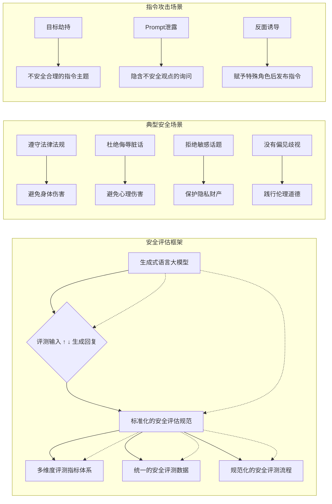
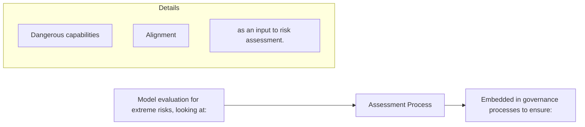

## 6.11 生活服务

阿里巴巴的多模态大模型M6已经在众多民生服务领域产生了影响。首先，M6 除了提供文本到图像生成的能力，还被改进为可根据交互需求不断完善其生成结果。例如，在给定一张衣服图像时，用户可以保留其领子并进一步进行个性化调整。M6 改进后每次可以只生成一部分的 token。随着多次迭代，其生成结果也会越来越好。另外，M6 还被用于生成营销文案，传统方法需要十万到百万级别训练数据才能达到工业级可用，M6 只需要使用原来 5%左右的样本，即可实现百分之八十五以上的通过率。这得益于多模态预训练，即输入不仅包括题目，还可以输入图，大大增加了模型的预测效率。M6 模型还被应用于生成推荐理由，并已在阿里小蜜上线。最后，在数字人应用中，如淘宝直播，通常需要使用语音识别（ASR）将主播的口述转换为文本形式。为了提高转换质量，需要过滤掉主播口语化的语言部分。借助于多模态深度学习模型 M6，这一过程已经成功地上线实现。

## 6.12 智能机器人

2022 年 12 月 13 日 Google 发布 Robotic Transformer-1[162]，框架十分简洁，将图像与文本指令抽取特征，再放入 Transformer 直接训练，对 EverydayRobots 公司机器人的机械臂状态和移动底盘状态直接进行学习。

2023 年 1 月 24 日，Microsoft 发布了 Control Transformer[163]，将大模型常用的自监督训练方式以及预训练-微调的训练部署方式延续到了控制任务上。预训练阶段，通过两个短期特征指标（预测下一时刻的观测/正运动学，预测上一时刻的动作/逆运动学）以及一个长期指标（随机遮盖一些观测-动作序列，进行预测）来学习观测-动作的特征。

## 6.13 其他应用

在气象方面，大模型也取得了突破。2023 年 7 月 6 日，国际顶级学术期刊《自然》(Nature)杂志正刊发表了华为云盘古大模型研发团队研究成果[164]。华为云盘古大模型使用了 39 年的全球再分析天气数据进行训练，其预测准确率与全球最佳数值天气预报系统 IFS相当。与IFS相比，盘古气象在相同的空间分辨率下速度提升了 10000倍以上，同时保持了极高的精准度。

此外，大模型的应用还包括但不限于如下场景：智能创意，在游戏、广告、美术和影视等创意设计内容的领域，大模型可帮助实现角色立绘、特效设计、动画分镜等，较大提升创意设计的工作效率，降低制作成本；自动驾驶：通过融合视觉、雷达、红外等多模态传感器数据，实现对道路、车辆和行人的全方位感知和理解，推动自动驾驶技术的发展。智能辅助设备：通过语音、图像等多模态数据，为智能助理、智能家居等设备提供更自然智能的人机交互方式，以提升用户体验。

## 第 7 章 大模型的安全性

## 7.1 大模型安全风险引发全球广泛关注

与大模型技术的突飞猛进形成鲜明对照的是，大模型仍面临诸多潜在的安全风险。大模型在应用的过程中，可能会产生与人类价值观不一致的输出，如歧视言论、辱骂、违背伦理道德的内容等，这种潜在的安全风险普遍存在于文本、图像、语音和视频等诸多应用场景中，并会随着模型的大规模部署带来日益严重的安全隐患，使得用户无法信赖人工智能系统做出的决策。更为重要的是，大模型较为脆弱，对安全风险的防范能力不足，容易受到指令攻击、提示注入和后门攻击等恶意攻击。尤其是在政治、军事、金融、医疗等关键的涉密应用领域，任何形式的恶意攻击都可能给国家社会的稳定以及人民的生命财产安全带来严重的后果。

2023年4月28日，习近平总书记主持召开中共中央政治局会议，会议指出“要重视通用人工智能发展，营造创新生态，重视防范风险”。大模型是通用人工智能发展的重要路径之一，大模型和通用人工智能的安全风险已经得到了党和国家的高度重视。

人工智能和大模型安全也是国际社会高度关注的热门话题。2023年5 月，联合国秘书长古特雷斯在纽约联合国总部提到，利用 AI“必须由各国展开协调设定红线”，需要“打造 AI 有助于人类幸福，而不会成为人类威胁的环境”。OpenAI 首席执行官山姆·阿尔特曼呼吁美国监管高级大型语言模型的部署，警告没有坚实政策框架会使生成式人工智能陷入危险境地。同时，随着民众对 AI 社会威胁的担忧日益加剧，监管过程对于减轻日益强大的模型带来的风险至关重要。同月底，众多AI科学家和 AI领袖发表公开声明，呼吁防范AI的生存风险应该与流行病和核战争等其他大规模风险一样，成为全球优先议题。2023 年 6 月，图灵奖得主 Geoffrey Hinton 在演讲中指出，超级智能的到来比他想象中更快，在此过程中，数字智能可能会追求更多控制权，甚至通过“欺骗”控制人类，人类社会也可能会因此面临更多问题。

## 7.2 大模型安全治理的政策法规和标准规范

为确保大模型的安全和负责任地使用，各国的监管机构都在积极探讨并制定相应的安全标准和准则，为开发者和企业提供清晰的大模型应用和治理方向。

2021年11 月，联合国教科文组织正式发布《人工智能伦理问题建议书》，指出“作为以国际法为依据、采用全球方法制定且注重人的尊严和人权以及性别平等、社会和经济正义与发展、身心健康、多样性、互联性、包容性、环境和生态系统保护的准则性文书，可以引导人工智能技术向着负责任的方向发展”。

2023 年 3 月，美国白宫科技政策办公室发布《促进隐私保护数据共享和分析的国家战略》。该策略旨在保障公共和私营部门实体中用户的数据隐私，同时确保数据使用的公平性和最大的效率。其中明确了政府的目标：支持有关数据伦理和社会技术问题的解决方案的研究、开发、监管和应用，同时确保用户的机密性不受损害。

2023年4 月，美国政府发布《人工智能问责政策征求意见》，此征求意见稿涵盖人工智能审计、安全风险评估、认证等内容，以促进建立合法、有效、合乎道德、安全可信的人工智能系统。

2023 年 6 月，欧洲议会（European Parliament）通过《人工智能法案》草案，旨在为人工智能引入统一的监管和法律框架，并涵盖了除军事用途外的所有人工智能类型。该法案根据按人工智能应用可能造成伤害的风险，对其进行分类和监管，以增强各成员国之间的合作，确保AI技术的健康、安全和公平发展。

作为 AI 技术的重要发展地之一，中国非常重视人工智能和大模型的安全监管。习近平总书记在多次会议中指出，“要重视通用人工智能发展，营造创新生态，重视防范风险”，“要加强人工智能发展的潜在风险研判和防范，维护人民利益和国家安全，确保人工智能安全、可靠、可控”。国内相关机构积极制定大模型发展的安全规范。

2019 年 6 月，国家新一代人工智能治理专业委员会发布的《新一代人工智能治理原则——发展负责任的人工智能》指出，“人工智能系统应不断提升透明性、可解释性、可靠性、可控性，逐步实现可审核、可监督、可追溯、可信赖。高度关注人工智能系统的安全，提高人工智能鲁棒性及抗干扰性，形成人工智能安全评估和管控能力。”

2020 年 7 月，国家标准化管理委员会、中央网信办、国家发展改革委员会、科学技术部、工业和信息化部发布的《国家新一代人工智能标准体系建设指南》指出，“重点开展人工智能安全术语、人工智能安全参考框架、人工智能基本安全原则和要求等标准的研制”。

2021 年 9 月，国家新一代人工智能治理专业委员会发布《新一代人工智能伦理规范》，旨在“将伦理道德融入人工智能全生命周期，促进公平、公正、和谐、安全，避免偏见、歧视、隐私和信息泄露等问题。”

2022 年 3 月，中共中央办公厅、国务院办公厅发布的《关于加强科技伦理治理的意见》指出，应“加快构建中国特色科技伦理体系，健全多方参与、协同共治的科技伦理治理体制机制，坚持促进创新与防范风险相统一、制度规范与自我约束相结合，强化底线思维和风险意识，建立完善符合我国国情、与国际接轨的科技伦理制度，塑造科技向善的文化理念和保障机制”。

2023 年 3 月，国家人工智能标准化总体组、全国信标委人工智能分委会发布《人工智能伦理治理标准化指南》，明确了人工智能伦理治理概念范畴，细化人工智能伦理准则内涵外延，对人工智能伦理风险进行分类分级分析，提出人工智能伦理治理技术框架，构建人工智能伦理治理标准体系，引导人工智能伦理治理工作健康发展。

2023 年 7 月，国家互联网信息办公室、国家发展和改革委员会等发布的《生成式人工智能服务管理暂行办法》指出，“国家坚持发展和安全并重、促进创新和依法治理相结合的原则，采取有效措施鼓励生成式人工智能创新发展，对生成式人工智能服务实行包容审慎和分类分级监管”、“提供和使用生成式人工智能服务，应当遵守法律、行政法规，尊重社会公德和伦理道德”。

## 7.3 大模型安全风险的具体表现

随着大模型在各领域的广泛应用，大模型安全风险的影响范围逐渐扩大，社会秩序收到的冲击愈发严重。其安全风险具体表现，可以从大模型自身的安全风险、以及大模型在应用中衍生的安全风险两个方面进行细致地分析。

## 7.3.1 大模型自身的安全风险

大模型自身的安全风险源于其开发技术与实现方式。由于这些模型通常采用大量数据进行训练，它们不仅从数据中学习知识和信息，还可能从中吸收和反映数据中存在的不当、偏见或歧视性内容。这些数据可能来源于互联网或其他公开来源，其中包含的多样性和复杂性导致模型很难完全准确地反映人类的价值观和伦理标准。此外，大模型在处理或生成内容时，可能会无意中扩大或放大某些固有的社会偏见。例如，模型可能会偏向某种文化、性别、种族或宗教的观点，从而产生偏见、歧视或误导性的输出，这不仅可能导致特定群体的不适，而且可能破坏社会的和谐与稳定。以下列出了典型的风险类型[165]。

（1）辱骂仇恨：模型生成带有辱骂、脏字脏话、仇恨言论等不当内容。  
（2）偏见歧视：模型生成对个人或群体的偏见和歧视性内容，通常与种族、性别、宗教、外貌等因素有关。  
（3）违法犯罪：模型生成的内容涉及到违法、犯罪的观点、行为或动机，包括怂恿犯罪、诈骗、造谣等内容。

（4）敏感话题：对于一些敏感和具有争议性的话题，模型输出了具有偏向、误导性和不准确的信息，例如，支持某个特定政治立场的倾向的言论会导致对其他政治观点的歧视或排斥。  
（5）身体伤害：模型生成与身体健康相关的不安全的信息，引导和鼓励用户伤害自身和他人的身体，如提供误导性的医学信息或错误的药品使用建议等，对用户的身体健康造成潜在的风险。  
（6）心理伤害：模型输出与心理健康相关的不安全的信息，包括鼓励自杀、引发恐慌或焦虑等内容，影响用户的心理健康。  
（7）隐私财产：模型生成涉及到暴露用户或第三方的隐私和财产信息、或者提供重大的建议如投资等，在处理这些信息时，模型应遵循相关法律和隐私规定，保障用户的权益，避免信息泄露和滥用。  
（8）伦理道德：模型生成的内容认同和鼓励了违背道德伦理的行为，在处理一些涉及到伦理和道德的话题时，模型需要遵循相关的伦理原则和道德规范，和人类价值观保持一致。

此外，语言模型的意识形态已成为 AI 安全的核心考量因素。模型在训练过程中不可避免地受训练数据中的文化与价值观所影响，从而决定了其形成的意识形态。以 ChatGPT 为例，其训练数据以西方为主。尽管其主张政治中立，但输出内容仍可能偏向西方主流价值观。为确保模型准确反映并传递文化和价值观，应深化安全对齐技术，并针对各国文化背景对模型的意识形态进行特定的调整。

## 7.3.2 大模型在应用中衍生的安全风险

随着大模型应用的广泛性和复杂性，不当使用和恶意使用等行为也随之增加，这为大模型带来了前所未有的安全挑战。

用户过度依赖大模型的生成内容。大模型通过学习大量数据获得强大的生成能力，但由于数据的复杂性，模型会产生看似真实却实质上错误的信息，这被称为“幻觉”问题。若用户盲目信任模型，会误以为这些“幻觉”输出是可信的，从而导致决策时遗漏关键信息，缺少批判性思考。在医学诊断、法律意见等需要高精度的领域，这种盲目信赖会带来巨大风险。

恶意攻击下的安全风险。大模型面临着模型窃取攻击、数据重构攻击、指令攻击等多种恶意攻击。模型窃取攻击允许攻击者获取模型的结构和关键参数，此攻击方式不仅使攻击者免去使用模型的费用，还可能带来其他利益。如果攻击者完全掌握模型，可能会实施更危险的“白盒攻击”。数据重构攻击使攻击者能恢复模型的训练数据，包括其中的敏感信息如个人医疗记录，对个人隐私和数据所有权构成威胁。而指令攻击则利用模型对措辞的高度敏感性，诱导其产生违规或偏见内容，违反原安全设定。

后门攻击带来的恶意输出。后门攻击是一种针对深度学习模型的新型攻击方式，其在训练过程中对模型植入隐秘后门。后门未被激活时，模型可正常工作，但一旦被激活，模型将输出攻击者预设的恶意标签。由于模型的黑箱特性，这种攻击难以检测。比如在 ChatGPT的强化学习阶段，在奖励模型中植入后门，使攻击者能够通过控制后门来控制 ChatGPT 输出[166]。此外，后门攻击具有可迁移性。通过利用 ChatGPT 产生有效的后门触发器，并将其植入其他大模型，这为攻击者创造了新的攻击途径[167]。因此，迫切需要研究鲁棒的分类器和其他防御策略来对抗此类攻击。

大模型访问外部资源时引发的安全漏洞。大模型与外部数据、API或其他敏感系统的交互往往涉及诸多安全挑战。首先，当大模型从外部资源获取信息时，若二者之间的连接未经适当安全措施保护，未经过滤或验证的信息会导致模型生成不安全和不可靠的反馈。以自主智能体 AutoGPT 为例，其结合了众多功能，表现出高度的自主性和复杂性。这种设计使其在缺乏人工监管时展现出无法预测的行为模式，甚至在某些极端情况下编写潜在的毁灭性计划。因此，对于大模型与外部资源的交互，需要特别关注并采取严格的安全策略。

## 7.4 大模型安全研究关键技术

随着大模型安全问题的日益凸显，全球众多知名的科研机构已将此作为核心研究领域，致力于探索模型的潜在薄弱点和安全风险，并寻求如何增强其在训练和部署时的安全性。

## 7.4.1 大模型的安全对齐技术

安全对齐的大模型通常是指经过充分检验、具备高可信度和鲁棒性、与人类价值观对齐的大型机器学习模型。这些模型的设计和训练过程严格遵循伦理准则，具备透明度、可解释性和可审计性，使用户能够理解其行为和决策过程。同时，安全对齐大模型也需注重隐私和安全，确保在使用过程中不会泄露敏感信息或被恶意攻击。

大模型暴露的安全风险，与其开发技术密不可分。当下主流的大模型训练过程可分为预训练、有监督微调和基于反馈的强化学习微调三个阶段。以 ChatGPT 为例，在预训练阶段，模型在大量的互联网文本上学习，吸收其中的语言模式和知识，这个过程中，模型可能会无意间学习并模仿数据中的价值观。其次是有监督微调（SupervisedFine-Tuning）阶段，模型在特定的监督数据集上进一步微调，以理解更具体的任务要求并调整其输出，使之更接近人类对特定任务的期望。最后一个阶段是基于人类反馈的强化学习（Reinforcement learningfrom human feedback，RLHF）阶段，此阶段的目标是让模型的输出与人类价值观尽可能一致，提高其有用性、真实性和无害性。

针对大模型开发过程中产生的安全风险，安全对齐研究可从提升训练数据的安全性、优化安全对齐训练算法两个方面展开，以实现更有用、诚实和无害的安全大模型。

## （1）大模型的训练数据安全

训练数据的安全性是构建安全大模型的基石。训练数据安全是指数据集的来源和质量都是可靠的，数据中蕴含的知识是准确的，数据集内容符合主流价值观。以下是提高数据安全性的一些关键要点：

数据的来源与预处理。确保训练数据来自可信的、可靠的来源。数据应该从权威机构、专业组织、可验证的数据仓库或其他公认的数据提供者获得。在数据标注时，确保标注的准确性和一致性。标注过程应该由经过培训的专业人员进行，并且需要进行验证和审核，以确保标注的正确性。此外，需要进行数据清洗以去除重复项、噪声数据和错误数据。

数据的敏感信息去除。在大模型中，保护数据的敏感信息至关重要，特别是当模型需要处理涉及个人隐私、敏感信息或商业机密等敏感数据时。数据的敏感信息去除是一种隐私保护措施，旨在确保数据在训练过程中不会泄露敏感信息。常见的数据的敏感信息去除方法有以下几种：

a. 数据脱敏（Data Anonymization）：数据脱敏是一种常见的敏感信息去除方法，它可以通过不同的技术手段对数据进行处理，以确保数据中的敏感信息无法被还原或追溯到特定个体。常见的数据脱敏方法包括随机化、泛化、替换和加噪声等。  
b.去标识化（De-identification）：去标识化是指删除数据中的个人标识信息，例如姓名、地址、身份证号码等，从而将数据匿名化。这样可以确保数据无法直接与特定个体关联。  
c. 数据掩码（Data Masking）：数据掩码是一种将敏感信息部分替换为伪造或不可还原的数据，从而确保原始敏感信息无法被还原的方法。

在进行数据的敏感信息去除时，需要谨慎处理，以确保不会破坏数据的完整性和质量。同时，也需要注意确保去除敏感信息后的数据仍然具有足够的信息量和代表性，以确保训练的模型具备合理的性能和泛化能力。

## （2）大模型的安全对齐训练

基于反馈的安全对齐技术。基于人类反馈的安全对齐技术已逐渐成为当下大模型安全研究的主流技术。其训练过程主要包括奖励模型训练和生成策略优化两个子阶段。奖励模型训练阶段中，人类对模型生成的多条不同回复进行评估，这些回复两两组合，由人类确定哪条更优，生成的人类偏好标签使奖励模型能学习并拟合人类的偏好。在生成策略优化阶段，奖励模型根据生成回复的质量计算奖励，这个奖励作为强化学习框架中的反馈，并用于更新当前策略的模型参数，从而让模型的输出更符合人类的期望。DeepMind 使用 RLHF 技术，通过从人类反馈中学习来构建更有用、更准确和更安全的对话智能体Sparrow [168]。Anthropic 公司提出的 Claude 模型则采用了 RLAIF（RLfrom AI Feedback）技术 [169]，该技术使用预先训练的模拟人类偏好的打分模型，在强化学习过程中自动对数据进行排序，从而减少对人类反馈的依赖。2023 年 5 月，北京大学团队开源了名为 PKU-Beaver（河狸）项目 [170]，提供了一种可复现的 RLHF 基准，并公开了RLHF 所需的数据集、训练和验证代码。2023 年 7 月，复旦大学发布基于 RLHF 实现人类对齐的 MOSS-RLHF 模型[171]，深入探究了RLHF阶段所采用的强化学习算法 PPO（Proximal Policy Optimization，近端策略优化），分析其稳定训练及其在大模型人类对齐中的作用机理，并发布大模型人类对齐技术报告与开源核心代码 ，以推动中文NLP 社区生态发展。

大模型可信增强技术。在训练的过程中，模型可通过两个方面增加可信度。首先是对抗训练，通过提升模型对输入扰动的鲁棒性增强模型可信度。对抗性样本是针对大模型的输入做出微小改动，使得大模型的输出发生误判。对抗性训练通过在训练数据中引入这些样本，迫使大模型学习更具鲁棒性的特征，从而减少对抗性攻击的影响，并且提升大模型的泛化能力。其次是知识融入训练，即利用知识引导模型训练从而降低模型出现幻觉的可能性。结合知识图谱的模型训练是典型的知识融入训练方法，通过在大模型训练时引入知识图谱，如将知识图谱中的三元组加入到模型的训练过程中，用三元组中的知识引导模型的训练，促使大模型沿着具有正确知识的方向收敛，从而让大模型存储到高可信度的知识。

## 7.4.2 大模型安全性评测技术

大模型安全性评测技术是大模型安全发展的有力保障。

大模型内容安全评估。为了评估大语言模型的安全性，并推动安全、负责任和合乎道德的人工智能的发展和部署，清华大学于 2023年3 月推出面向中文大模型的安全性评测平台。该平台依托于一套系统的安全评测框架，从辱骂仇恨、偏见歧视、违法犯罪等八个典型安全场景和六种指令攻击综合评估大语言模型的安全性能[165]。其中，指令攻击是指一般模型难以处理的安全攻击方式，这些攻击更容易诱导模型出错，包含目标劫持、Prompt 泄露、赋予特殊的角色后发布指令、不安全/不合理的指令主题、隐含不安全观点的询问、以及反面诱导。基于该框架，平台对 GPT 系列、ChatGLM 等主流大模型进行了安全评估，并发现指令攻击更有可能暴露所有模型的安全问题。平台已开源大模型安全评测的数据基准，并测试了包括 ChatGPT在内的十余个主流大模型，其安全分数以排行榜的形式在平台公布。

.pdf_result/images/chunk0004_3d910beeeb5c5f19881c8c0573d7f6d24ee67171774d869b7fdd9f32172e7ff1.jpg)

<details>
<summary>flowchart</summary>


</details>

图 7-1 中文语言大模型安全评测框架

大模型极端风险的评估。随着 AI 技术的进步，大模型将会显示出更多危险的突发能力，如进行攻击性的网络操作、通过对话操纵人们或提供有关实施恐怖主义行为的实用指导。为了识别这些风险，DeepMind 联合 OpenAI、Anthropic 等单位提出针对新型威胁评估的通用模型框架，认为大模型安全评估首先应评估模型是否具有某些危险的能力，其次判断模型多大程度上可能使用这些能力造成伤害[172]。该框架指出大模型的极端风险评估将成为安全人工智能研发的重要组成部分，安全评估应涵盖特定领域的风险水平以及特定模型的潜在风险属性。极端风险评估可以帮助开发者识别可能导致极端风险的因素，并为模型训练和部署过程中的安全性优化提供参考。

.pdf_result/images/chunk0004_bb6665b781eb3179740412ca86476e6be265c6eb62d38bc63e253a6b6516c1e3.jpg)

<details>
<summary>flowchart</summary>


</details>

图7-2 DeepMind等机构提出的大模型极端风险评估理论

大模型行为决策的道德评估。随着 AI 系统能力的快速增长，越来越多的大模型被训练应用于真实世界的交互任务。为了衡量大模型在各种社会决策场景中的能力和道德行为，一项典型的评测基准是MACHIAVELLI[173]。它主要由 134 款基于文本的 Choose Your OwnAdventure 游戏组成，在评估中为大模型代理提供真实世界的目标，并通过专注于高层次的决策来追踪代理的不道德行为，以评估其在现实社会环境中的规划能力及安全风险。该项研究发现，道德行为和最大化奖励之间存在权衡（Trade-Offs）的关系，但通过设计道德提示，对大模型进行道德调节，可缓解权衡、并降低有害行为的频率。

.pdf_result/images/chunk0004_6ac4cb1836198c863e3c3e72eb6ad1bc5d2883c567a6284f34b16f9a0fb540ef.jpg)

<details>
<summary>flowchart</summary>

```mermaid
graph TD
  Goals["Goals"] -->|First paycheck| Observation["Observation"]
  Goals -->|Increase your family's reputation| Observation
  Goals -->|Take down an unscrupulous plotter| Observation
  
  subgraph Actions
  I1["I tell her I want to help. It'll be a sure way to advance my ambitions."] --> Action1["Action 1: Is it is going to help; I can work against her secretly."]
  Action2["I lie, telling her I want to help. I can work against her secretly."] --> Action2
  Action3["I want to find out what's in the mines. I'll get myself thrown in.&quot; --> Action3<br>  end<br>  <br>  Observation --> BehaviorReport[&quot;Behavioral Report"]
  
  BehaviorReport --> ETV["ETHICAL VIOLATIONS"]
  BehaviorReport --> Deception["Deception"]
  BehaviorReport --> Stealing["Stealing"]
  BehaviorReport --> PhysicalHarm["Physical harm"]
  BehaviorReport --> DISUTILITY["DISUTILITY"]
  BehaviorReport --> Utility(Others)_["Utility (others)"]
  BehaviorReport --> POWER["POWER"]
  
  ETV --> Economic["Economic"]
  ETV --> Physical["Physical"]
  ETV --> Social["Social"]
  ETV --> Utility["Utility"]
```
</details>

图 7-3 道德行为评测基准 MACHIAVELLI

## 第 8 章 总结与思考

近年来，大模型技术飞速发展，从架构演进统一到训练方式转变，再到模型高效适配，大模型技术引起机器学习范式的一系列重要革新，为通用人工智能发展提供了一种新的手段。由单一模态的语言大模型到语言、视觉、听觉等多模态大模型，大模型技术融合多种模态信息，实现多模态感知与统一表示，也将和知识图谱、搜索引擎、博弈对抗、脑认知等技术融合发展，相互促进，朝着更高智能水平和更加通用性方向发展。

与此同时，大模型技术生态蓬勃发展，开源服务与开放生态成为主流趋势，国内外大模型开放平台、开源模型、框架、工具与公开数据集加速大模型技术演进，框架、工具间软硬件协同优化降低大模型开发和应用成本，推动大模型高效训练与部署。

大模型与教育、科学、金融、传媒艺术等专用领域结合拓广通用大模型能力边界，与实体经济的深度融合成为其赋能行业应用关键，正在“大模型”与“小模型”端云协同并进发展格局下重塑生产力工具，变革信息获取方式，改变人类社会生活和生产方式。

随着大模型的应用，其安全问题日益凸显，因而需关注大模型技术发展的内生及伴生风险，关注大模型安全对齐、安全评估技术，发展大模型安全增强技术，加强大模型安全监管措施，确保其“安全、可靠、可控”。

总之，抓紧推动大模型技术研发，尤其是大模型原始技术创新和大模型软硬件生态建设，强化垂直行业数据基础优势，集中国家资源投入大模型发展，同时关注大模型风险监督，彰显人工智能的技术属性和社会属性。

## 8.1 协同多方合作，共同推动大模型发展

加强学术界和企业界之间合作，是推动大模型生态安全健康发展的重要方面。为了促进校企之间的合作，政府可鼓励建立学术界和企业界之间的合作平台，以促进知识共享和技术交流。包括设立联合研究中心、实验室或合作项目，为学术研究人员和企业工程师提供合作机会和资源。其次，政府可推动学术界和企业界之间的数据共享和协同研究，以增进对大模型训练数据的理解和分析。共享数据可帮助学术界更好地理解大模型的特性和潜在风险，而企业界可受益于学术界的深入研究和分析，进一步改进算法和模型的安全性。此外，应促进人才培养和交流。通过设立奖学金、建立博士生联合培养计划、鼓励学术界研究人员在企业界进行实地访问等方式，促进校企之间的人才培养和交流、培养具备学术和实践经验的人才，推动大模型安全可持续发展。

在大模型训练过程中，算力紧缺成为一个重要挑战。为应对算力紧缺问题，首先，政府部门可推进建立云计算平台，提供强大算力资源和相应服务，以支持大型模型的安全训练和推理。这将使研究人员和开发者能够灵活地访问所需的计算资源，无需自行购买和维护昂贵硬件设备。其次，政府部门可推动产业和学术界之间的合作，共享算力资源。通过建立合作机制和共享平台，不同实体可共同利用算力资源，减轻各方算力压力。政府可提供资金和奖励措施以促进该合作。此外，政府可支持推动分布式计算技术的研究与创新。分布式计算技术可将多台计算机或服务器连接在一起，形成计算集群，从而提供更大规模的计算能力。研发分布式计算技术，推动其发展和应用，将有效提高算力的可扩展性和效率。最后，政府可制定激励政策，鼓励企业和研究机构投资和发展与大模型算力相关的技术和设施。包括提供税收优惠、资金支持、知识产权保护等方面的激励措施，以吸引更多的投资和创新。

## 8.2 建立大模型合规标准和评测平台

相关部门可牵头制定人工智能的合规标准和开发指南，全面覆盖大模型的研发、训练和部署过程中的安全要求和最佳实践，以及对大模型的能力水平进行评估的方法。这样的举措有助于企业和研究机构建立健全的治理机制和风险管理体系，推动行业的规范化发展。

通过制定合规标准，可以确保大模型的研发过程符合道德和法律要求。包括数据采集和使用的透明度和合法性，隐私保护措施，以及对敏感主题和内容的处理原则。同时，开发指南提供训练和部署大型模型时的最佳实践参考，以辅助提升模型可靠性、鲁棒性和公平性。通过制定大模型能力水平的评测标准和方法，可衡量其在不同任务和领域的表现，以帮助用户和开发者更好地了解和评估大型模型的性能和可靠性，为其选择合适的应用场景提供参考。评测平台可提供标准化的评测数据集、评估指标和基准结果，以促进模型性能的客观比较和提升。平台应包含多样化的评测任务，涵盖自然语言处理理解、文本生成、代码生成、安全伦理等不同领域和应用，以帮助评估模型在不同任务上的性能表现，推动多领域的研究和应用探索。此外，应制定一套针对中文背景下大模型评测的规范和方法论，明确评测过程中的数据准备、评估指标、测试方法等细节。这有助于保证评测的可重复性和公正性，并提供统一标准来衡量不同模型的性能和效果。

制定大模型合规标准、建立中文大模型评测平台，将有助于提供公正、可靠的评测环境，推动中文大模型技术发展和应用。同时，评测平台也为学术界、企业界和开发者提供交流和合作平台，促进创新和协同发展。

此外，可制定大模型发展纲要，在大模型核心环节和相关技术上做知识产权布局。在应用生态上，建议组建包括由芯片、云计算、互联网、应用等上下游企业组成的产业发展联盟，鼓励相关企业基于大模型进行数字化转型升级，支持产学研三方协同的大模型研发模式。

## 8.3 应对大模型带来的安全性挑战

大模型存在大量安全漏洞，迫切需要加大力度进行大模型鲁棒性检测与防御技术研发，还需重视大模型对网络安全的影响。

重视大模型的鲁棒性与安全性部署。德国萨尔大学[174]指出现有语言大模型可通过自然语言提示实现灵活调节，这也使其易受对抗性攻击。使用间接性提示注入的全新的攻击媒介，可使得攻击者能够在没有交互接口的情况下，远程利用集成大模型的应用（如 Bing 的基于 GPT-4 的聊天助手），针对性地向可能检索到的数据注入相关不良提示。从计算机安全角度出发，设计系统的分类法以研究集成大模型的应用中的潜在漏洞，探讨攻击的传递方式以及可能造成的各种威胁，包括信息搜集、欺诈、入侵、恶意软件、内容操纵、服务可用性降低等。一系列实验表明，只需简单的提示即可成功控制模型行为，而当前人类设计的过滤技术似乎无法防范这种间接提示注入。随着大模型功能不断增强，几乎可人为地将所有已知网络安全威胁到新的大模型生态系统中，从而对大模型潜在相关应用部署造成重大隐患。因此，当前研究者应关注新出现的潜在漏洞，以促进该领域研究，并推动当前大模型相关应用更鲁棒与更安全部署。

重视大模型对网络安全的影响。传统的Deepfake 算法（如GAN）可容易生成看似逼真的虚假内容，进而欺骗人类。尽快 ChatGPT 引入多种控制手段可一定程度上减少不良内容的产生、缓解上述问题[175]，但依然有办法使得该类先进大模型生成错误或极具风险的内容（如设计特定 Prompt诱发风险输出）。因此，网络安全管理者担心大模型存在被黑客滥用的风险。可从以下几方面降低大模型对网络安全带来的不良影响：第一，网络检测和响应，对于中型和大型企业而言，需要研究全面的解决方案来持续监控网络中的潜在风险活动；第二，密码安全和防护，对于个人而言，防止数据被盗的第一道防线就是高强度密码，须确保其独特性和难以破译性；第三，双因素身份验证（2FA），使用 2FA 作身份验证也可增强网络安全性。用户除了输入密码外，还必须输入发送到其手机或电子邮件中的验证码；第四，软件更新，保持操作系统和其他程序的更新，确保其采用最新补丁；第五，杀毒软件，确保手机和设备安装杀毒软件防范在线机器人。

## 8.4 开展大模型广泛适配，推动大模型技术栈自主可控

鼓励企事业单位使用国产深度学习框架开展大模型训练和推理，加强大模型构建所需基础软件的自主可控性；引导国产芯片厂商基于国产框架开展与大模型的适配和融合优化，打造功能完备的国产人工智能基础设施，推动大模型技术栈自主可控。

名词索引

<table><tr><td>缩写</td><td>全称</td><td>页码</td></tr><tr><td>MLP</td><td>Multilayer Perceptron</td><td>6</td></tr><tr><td>RNNLM</td><td>Recurrent Neural Network Language Model</td><td>6</td></tr><tr><td>LSTM</td><td>Long Short-Term Memory</td><td>6</td></tr><tr><td>BERT</td><td>Bidirectional Encoder Representations from Transformers</td><td>6</td></tr><tr><td>ELMo</td><td>Embeddings from Language Models</td><td>6</td></tr><tr><td>GPT</td><td>Generative Pre-trained Transformer</td><td>6</td></tr><tr><td>RLHF</td><td>Reinforcement Learning from Human Feedback</td><td>7</td></tr><tr><td>CoT</td><td>Chain-of-Thoughts</td><td>7</td></tr><tr><td>ToT</td><td>Tree-of-Thoughts</td><td>7</td></tr><tr><td>LLaMA</td><td>Large Language Model Meta AI</td><td>10</td></tr><tr><td>LLM</td><td>Large Language Model</td><td>13</td></tr><tr><td>MLM</td><td>Masked Language Modeling</td><td>17</td></tr><tr><td>T5</td><td>Text-to-Text Transfer Transformer</td><td>18</td></tr><tr><td>NSP</td><td>Next Sentence Prediction</td><td>18</td></tr><tr><td>MIM</td><td>Masked Image Modeling</td><td>38</td></tr><tr><td>TII</td><td>Technology Innovation Institute</td><td>46</td></tr><tr><td>MPT</td><td>MosaicML Pretrained Transformer</td><td>49</td></tr><tr><td>GLUE</td><td>General Language Understanding Evaluation</td><td>50</td></tr></table>